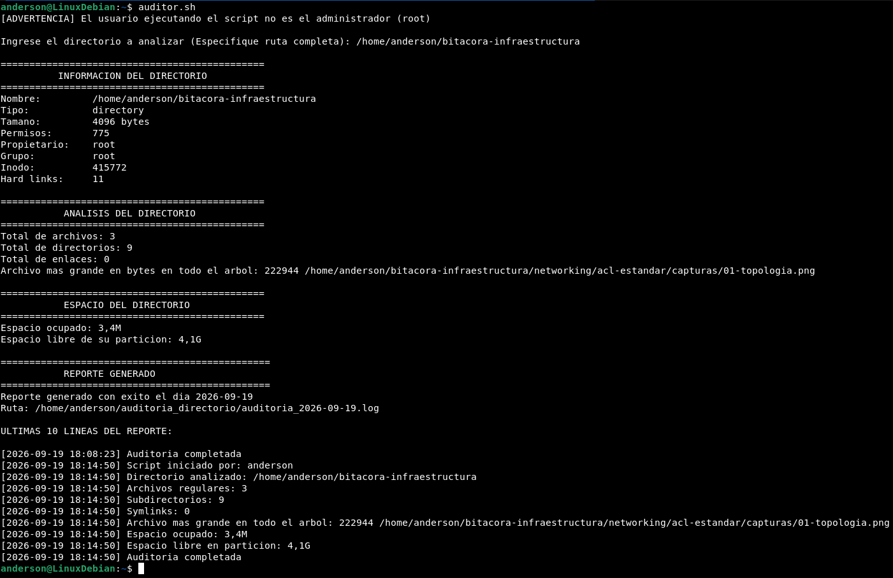
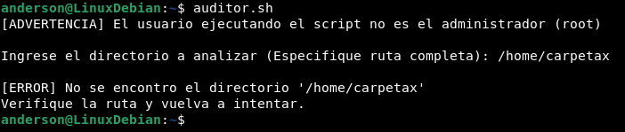
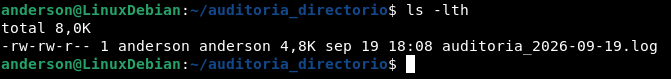

# Sistema de Auditoría de Directorios

Script en Bash para analizar cualquier directorio del sistema y generar un 
reporte con su información básica, conteo de contenido y uso de espacio — 
con persistencia en log diario.

## Script

[auditor.sh](./auditor.sh)

## Qué hace

- Verifica que el usuario tenga los comandos necesarios (`stat`, `du`, `df`, `find`) antes de continuar
- Pide un directorio al usuario y valida que exista
- Muestra metadata del directorio (`stat`): tipo, tamaño de inodo, permisos, propietario, hard links
- Cuenta archivos, subdirectorios y enlaces simbólicos en el primer nivel
- Encuentra el archivo más grande en todo el árbol (búsqueda recursiva, a diferencia del resto de los conteos)
- Calcula espacio ocupado (`du -sh`) y espacio libre en la partición (`df -h`) — dos métricas distintas a propósito, ya que el tamaño de un directorio por `stat` es solo el inodo, no su contenido real
- Registra cada ejecución en un log diario acumulativo (`~/auditoria_directorio/auditoria_YYYY-MM-DD.log`)

## Técnicas de Bash demostradas

| Técnica | Dónde |
|---|---|
| Validación de dependencias antes de ejecutar | Loop sobre array con `type` |
| Arrays | `comandos=(stat du df find)` |
| Manejo de errores con salida temprana | `exit 1` en cada validación fallida |
| Citado consistente de variables | Todo el script |
| Redirección agrupada a archivo | Bloque `{ ... } >> archivo` |
| `find` con distintos niveles de profundidad según el propósito | `-maxdepth 1` vs búsqueda recursiva |
| Comandos externos: `stat`, `du`, `df`, `find`, `sort`, `tail`, `awk` | Todo el script |

## Verificación

**Ejecución exitosa** contra un directorio real:

**Manejo de error** — directorio inexistente:

**Persistencia del reporte** — el log queda guardado tras la ejecución:

