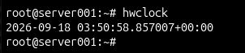
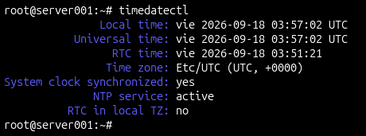
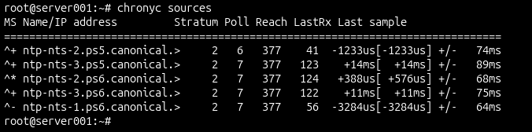
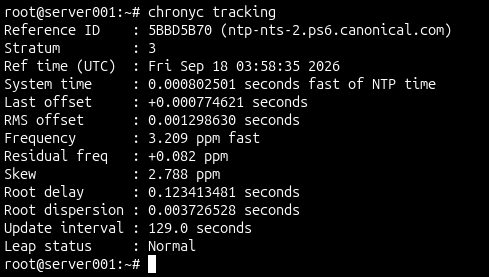
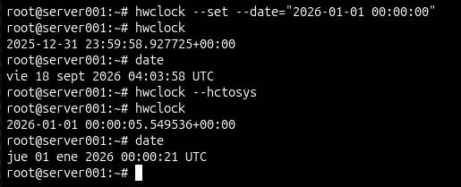
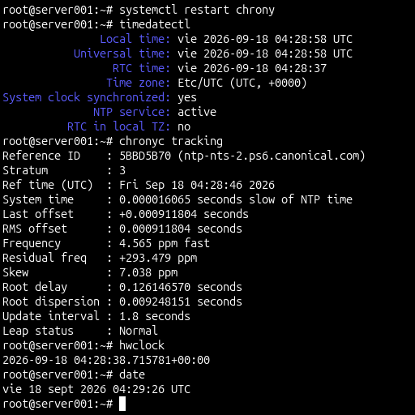

# Gestión del Tiempo en un Servidor Linux

En un servidor Linux no hay un solo reloj — hay dos, y entender cómo funcionan juntos es clave para cualquier administrador. Acá documento lo que practiqué sobre el tema: los dos relojes del sistema, cómo sincronizarlos manualmente y cómo dejar que un servicio NTP lo haga automáticamente con precisión de milisegundos.

---

## Los dos relojes del servidor

### Reloj de hardware (RTC)

El RTC (Real Time Clock) es un chip que vive en la tarjeta madre con su propia batería. No le importa si el servidor está apagado — sigue contando el tiempo igual. Cuando el servidor enciende, el kernel lo lee para saber qué hora es y arrancar con la hora correcta.

```bash
hwclock
```



---

### Reloj del sistema operativo

Una vez que el kernel arranca y lee el RTC, monta su propio reloj en RAM. Ese es el reloj que usan todos los servicios y programas del servidor. Si apagas el servidor, ese reloj desaparece — por eso el RTC existe, para que al volver a encender haya una referencia.

```bash
date
```


---

## Estado completo del tiempo

Con un solo comando se puede ver todo junto: hora local, hora UTC, hora del RTC, zona horaria y si está sincronizado con NTP o no.

```bash
timedatectl
```

Algo importante: los servidores usan UTC en vez de hora local. Esto es para que los logs sean interpretables por cualquier administrador en cualquier parte del mundo sin confusión de zonas horarias.



---

## Sincronización con NTP usando Chrony

NTP (Network Time Protocol) es el protocolo que permite sincronizar el reloj del servidor con fuentes de tiempo oficiales en internet. El software moderno que implementa NTP en Ubuntu es **chrony** — más preciso que el cliente clásico y ya viene instalado por defecto en Ubuntu 26.04.

### Servidores NTP conectados

```bash
chronyc sources
```

Acá se ven los servidores de Canonical con los que chrony sincroniza. El `**` indica el servidor principal que está usando en ese momento. El número de stratum indica qué tan cerca está de la fuente de tiempo original — stratum 1 son los relojes atómicos de referencia, stratum 2 son los que sincronizan de ellos, y así sucesivamente.



---

### Precisión de sincronización

```bash
chronyc tracking
```

Acá se ve qué tan preciso está el reloj del servidor respecto al tiempo NTP. En condiciones normales el desfase es de milisegundos o menos.



---

## Cambio manual del RTC

Cuando un servidor no tiene acceso a internet no puede sincronizar con NTP — en ese caso hay que poner la hora manualmente en el RTC y luego decidir si se sincroniza el sistema con el hardware o al revés.

```bash
# Cambiar el RTC manualmente
sudo hwclock --set --date="2026-01-01 00:00:00"

# Ver el RTC con la hora nueva
hwclock

# Sincronizar el sistema operativo con el RTC
sudo hwclock --hctosys

# Verificar que el sistema tomó la hora del RTC
date
```

Acá se puede ver claramente cómo el sistema operativo tomó la hora incorrecta del RTC después del cambio manual — el reloj del SO pasó a enero aunque antes estaba en septiembre. Esto demuestra que los dos relojes son independientes y que hay que tener cuidado con este comando en producción.



---

## Recuperación y resincronización con Chrony

Después del cambio manual, el servidor quedó con la hora incorrecta. Chrony detectó el desfase pero no pudo corregirlo solo porque el salto fue demasiado brusco. La solución fue reiniciar chrony para que retome la conexión con los servidores NTP y forzar la sincronización inmediata.

```bash
# Reiniciar chrony
sudo systemctl restart chrony

# Forzar sincronización inmediata
sudo chronyc makestep

# Verificar que todo volvió a la normalidad
timedatectl
chronyc tracking
hwclock
date
```

Resultado final: reloj sincronizado con precisión de milisegundos, RTC y sistema operativo alineados, NTP activo y funcionando.



---

## Comandos de referencia rápida

| Comando | Para qué sirve |
|---|---|
| `hwclock` | Ver la hora del RTC |
| `date` | Ver la hora del sistema operativo |
| `timedatectl` | Ver estado completo del tiempo |
| `hwclock --set --date="YYYY-MM-DD HH:MM:SS"` | Cambiar el RTC manualmente |
| `hwclock --hctosys` | Copiar hora del RTC al sistema operativo |
| `hwclock --systohc` | Copiar hora del sistema al RTC |
| `chronyc sources` | Ver servidores NTP conectados |
| `chronyc tracking` | Ver precisión de sincronización |
| `chronyc makestep` | Forzar sincronización inmediata |
| `systemctl restart chrony` | Reiniciar el servicio chrony |

---

## Entorno

- **Sistema operativo:** Ubuntu Server 26.04 LTS
- **Kernel:** Linux 7.0.0-22-generic
- **Servicio NTP:** Chrony 4.8
- **Servidores de tiempo:** ntp-nts.ps5.canonical.com / ntp-nts.ps6.canonical.com
