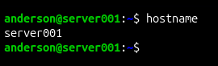
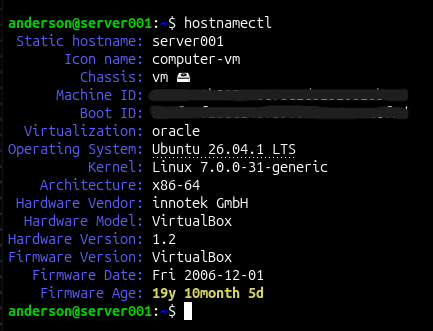
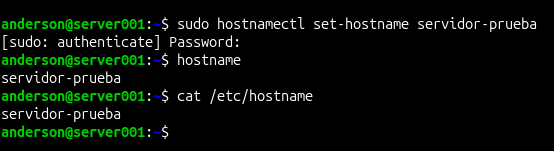
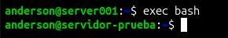
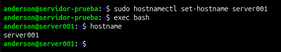
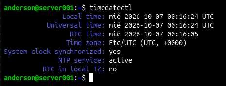
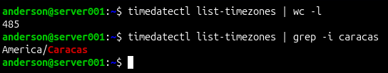
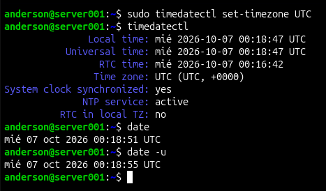
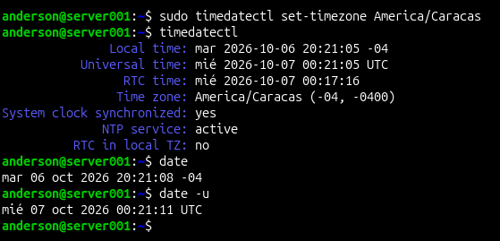
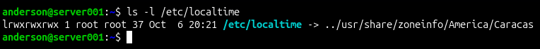

# 🕒 Linux Server — Nombre del servidor y zona horaria

Práctica de la sección de administración básica del curso de Linux Server. Se documenta cómo ver y cambiar el nombre del servidor (`hostname`) y la zona horaria (`timedatectl`), cada paso con su captura y una explicación breve. Incluye una sección sobre cuándo conviene **UTC** y cuándo una **zona local**.

## 🖥️ Entorno

- Ubuntu Server 26.04 en VirtualBox.
- Nombre original del servidor: `server001`. Para la prueba se cambió a `servidor-prueba` y se restauró al final.
- Zona horaria inicial: `Etc/UTC`. Zona final: `America/Caracas` (UTC−4).
- Las capturas están en la carpeta `capturas/`. Se ocultaron el *Machine ID* y el *Boot ID*.

## 📋 Resumen de comandos

| Comando | Para qué sirve |
|---|---|
| `hostname` | Muestra el nombre actual del servidor |
| `hostnamectl` | Detalle del nombre y del sistema (SO, kernel, virtualización) |
| `sudo hostnamectl set-hostname <nombre>` | Cambia el nombre del servidor |
| `timedatectl` | Resumen de hora, zona horaria y estado de NTP |
| `timedatectl list-timezones` | Lista las zonas horarias disponibles |
| `sudo timedatectl set-timezone <zona>` | Cambia la zona horaria |
| `date` / `date -u` | Muestra la hora local / la hora UTC |

---

## 🖥️ Parte 1 — Nombre del servidor

### 1. Ver el nombre actual

```bash
hostname
```



Muestra el nombre que el kernel está usando en este momento: `server001`.

### 2. Detalle del nombre y del sistema

```bash
hostnamectl
```



Además del nombre, muestra información del sistema:

- `Static hostname`: el nombre guardado en `/etc/hostname`, que se aplica al arrancar.
- `Chassis: vm` y `Virtualization: oracle`: es una máquina virtual de VirtualBox.
- `Operating System` y `Kernel`: Ubuntu 26.04.1 LTS y la versión del kernel en ejecución.

Existen tres tipos de nombre: **estático** (el de `/etc/hostname`), **transitorio** (el que usa el kernel en ejecución, puede venir del DHCP) y **pretty** (un nombre libre para humanos).

### 3. Cambiar el nombre

```bash
sudo hostnamectl set-hostname servidor-prueba
hostname
cat /etc/hostname
```



- El cambio se aplica **al instante**: `hostname` ya devuelve el nombre nuevo.
- Queda guardado en `/etc/hostname`, por lo que sobrevive a un reinicio.
- Fíjate en que el **prompt sigue mostrando `server001`**: la sesión abierta todavía no se ha enterado.
- Por defecto, `set-hostname` modifica los tres tipos de nombre a la vez.

### 4. El prompt se actualiza con una sesión nueva

```bash
exec bash
```



Bash toma el nombre del servidor cuando arranca la sesión, por eso el prompt no cambia solo. `exec bash` reinicia el shell y el prompt pasa a `anderson@servidor-prueba`. Iniciar una sesión nueva (por ejemplo, reconectando por SSH) tiene el mismo efecto.

### 5. Restaurar el nombre original

```bash
sudo hostnamectl set-hostname server001
exec bash
hostname
```



Se deja el laboratorio como estaba para que el resto de las evidencias sigan siendo coherentes.

**Recomendaciones para el nombre:** minúsculas, números y guiones, sin espacios. Si `/etc/hosts` conserva una línea `127.0.1.1` con el nombre viejo, conviene actualizarla; si no, `sudo` puede mostrar avisos de que no resuelve el nombre del servidor.

---

## 🕒 Parte 2 — Zona horaria

### 6. Estado inicial de la hora

```bash
timedatectl
```



- `Local time` y `Universal time`: la hora en la zona configurada y la hora en UTC. Aquí coinciden, porque la zona inicial es `Etc/UTC`.
- `RTC time`: la hora del reloj de hardware.
- `Time zone`: la zona configurada.
- `System clock synchronized: yes` y `NTP service: active`: el reloj del sistema se sincroniza con NTP.
- `RTC in local TZ: no`: el RTC guarda la hora en UTC.

### 7. Listar las zonas disponibles

```bash
timedatectl list-timezones | wc -l
timedatectl list-timezones | grep -i caracas
```



Hay 485 zonas en este sistema, así que conviene filtrar con `grep`. Los nombres siguen el formato `Región/Ciudad` de la base de datos IANA (`America/Caracas`). Son ciudades representativas de cada zona, no necesariamente capitales (por ejemplo, `America/New_York`).

### 8. Configurar la zona en UTC

```bash
sudo timedatectl set-timezone UTC
timedatectl
date
date -u
```



- `Time zone: UTC (UTC, +0000)`.
- `date` y `date -u` muestran la misma hora: en UTC la hora local y la universal son iguales. La diferencia de unos segundos entre ambas es el tiempo que pasó entre un comando y otro, no la zona horaria.
- `Etc/UTC` y `UTC` son dos nombres para la misma hora (+0000).

### 9. Configurar una zona local

```bash
sudo timedatectl set-timezone America/Caracas
timedatectl
date
date -u
```



- `Time zone: America/Caracas (-04, -0400)`.
- `Local time` marca martes 6 a las 20:21 y `Universal time` miércoles 7 a las 00:21: es el **mismo instante**, mostrado de dos formas. La diferencia es de 4 horas y, como se ve, **hasta el día cambia**.
- `RTC in local TZ: no`: cambiar la zona no modifica el RTC, que sigue en UTC.

### 10. Cómo guarda Linux la zona horaria

```bash
ls -l /etc/localtime
```



`/etc/localtime` es un enlace simbólico a un archivo de `/usr/share/zoneinfo/`. Cambiar la zona consiste en apuntar ese enlace a otra zona. La fecha del enlace (20:21) coincide con el momento del cambio.

---

## ⚖️ ¿UTC o zona local?

Cambiar la zona horaria solo cambia **cómo se muestra** la hora. El instante real y el reloj del sistema siguen siendo los mismos.

| | UTC | Zona local (ej. `America/Caracas`) |
|---|---|---|
| Qué es | Hora universal, sin cambios de horario | La hora de una región (Venezuela: UTC−4 todo el año) |
| Ventajas | Los logs de servidores de distintas regiones se pueden comparar y correlacionar sin conversiones. No se ve afectada por horarios de verano. | Coincide con la hora que ven usuarios y negocio. Las tareas de `cron` se ejecutan en el horario que espera la organización. |
| Inconvenientes | Hay que convertir a la hora local al leer reportes. | Comparar logs de servidores en zonas distintas es confuso. Los cambios de horario de verano pueden repetir o saltarse horas. |
| Cuándo usarla | **Recomendada para servidores de producción**, clústeres, logs y auditorías. | Cuando un requisito lo pide: tareas programadas en hora local o un único servidor que atiende a una sola región. |

`cron` programa las tareas según la zona horaria del sistema, así que cambiarla también cambia a qué hora se ejecutan.

**Criterio:** en producción, UTC. Cuando el requisito exige hora local, se configura la zona correspondiente. Ambas configuraciones se demuestran en este laboratorio.

---

## 📝 Observaciones

- **RTC por detrás del reloj del sistema.** En las capturas 06, 08 y 09 el `RTC time` va por detrás de la hora del sistema (≈ 19 s, ≈ 2 min y ≈ 4 min) y la diferencia crece, aunque el reloj del sistema está sincronizado por NTP. Causa no determinada, no investigado.
