# 🔑 Linux Server — Autenticación por llaves SSH (`ssh-keygen`)

Práctica de la sección de administración del curso de Linux Server. Se configura el acceso por **llaves SSH** a un servidor desde dos clientes (Windows y una VM Debian), para entrar sin escribir la contraseña en cada login. Cada paso va con su captura y una explicación breve.

## 🖥️ Entorno

- **Servidor:** Ubuntu Server 26.04 (`server001`), SSH en el puerto 22, usuario `anderson`.
- **Cliente 1:** Windows, con PowerShell (OpenSSH).
- **Cliente 2:** VM Debian (`LinuxDebian`).
- La IP del servidor cambia por DHCP; en este laboratorio fue `192.168.1.53`. En los comandos de explicación se usa `IP_SERVIDOR`.
- Las llaves del laboratorio se generaron **sin passphrase**: es una decisión de laboratorio, no una recomendación.
- En las capturas solo aparecen llaves **públicas**. Se ocultó la IPv6 de los mensajes de bienvenida.

## 📖 Concepto

Se genera un **par de llaves** matemáticamente ligadas: la **privada** (secreta, no sale del equipo) y la **pública** (se puede dar a cualquier servidor). Lo que firma la privada solo lo verifica la pública.

**Se hace una vez:** se genera el par en el cliente y se copia la pública al servidor, en `~/.ssh/authorized_keys` del usuario con el que se quiere entrar.

**En cada login:**

1. El cliente ofrece su llave pública.
2. El servidor comprueba que esa llave está en `authorized_keys`.
3. El cliente firma datos de la sesión con su privada y el servidor verifica la firma con la pública.
4. Si coincide, entra. **La privada nunca viaja por la red**: solo viaja la prueba de que se tiene.

| Archivo | Dónde está | Quién verifica a quién |
|---|---|---|
| `authorized_keys` | En el **servidor** (`~/.ssh/`) | El servidor verifica al **cliente** |
| `known_hosts` | En el **cliente** (`~/.ssh/`) | El cliente verifica al **servidor** |

**Por qué se usa en producción:** es el estándar por **seguridad** (no se adivina por fuerza bruta), **automatización** (scripts y backups que entran sin intervención) y **control** (revocar un acceso es borrar una línea de `authorized_keys`). Una vez comprobado que las llaves funcionan, se suele desactivar el acceso por contraseña.

**Passphrase:** la privada puede protegerse con una frase local que nunca viaja al servidor y solo desbloquea el archivo. Con una passphrase vacía, quien copie el archivo de la privada entra al servidor.

## 📋 Resumen de comandos

| Comando | Para qué sirve |
|---|---|
| `ssh-keygen -t ed25519 -f <ruta> -C "<comentario>"` | Genera el par de llaves |
| `scp` + `cat >> ~/.ssh/authorized_keys` | Instala la pública a mano (en Windows no existe `ssh-copy-id`) |
| `ssh-copy-id usuario@ip` | Instala la pública en el servidor (Linux) |
| `ssh -i <privada> usuario@ip` | Entra indicando qué llave privada usar |
| `cut -d' ' -f1,3 ~/.ssh/authorized_keys` | Lista tipo y comentario de las llaves autorizadas |

---

## 🪟 Parte 1 — Windows → servidor

### 1. Estado inicial

```powershell
dir $env:USERPROFILE\.ssh
```

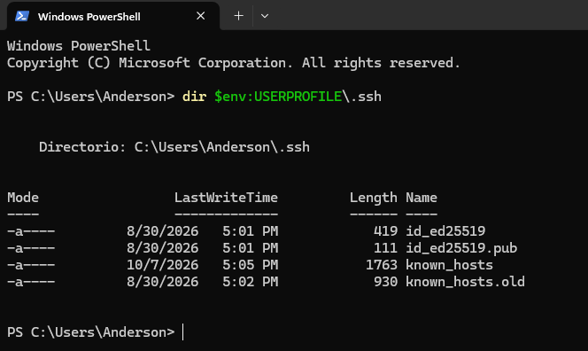

Ya existía un par `id_ed25519` (creado el 30 de agosto). No se sobrescribe: se genera una **llave nueva con otro nombre**. En administración se suele usar una llave por propósito, para poder revocar solo la que se pierda.

### 2. Generar el par de llaves

```powershell
ssh-keygen -t ed25519 -f $env:USERPROFILE\.ssh\id_ed25519_lab -C "anderson@windows-lab"
```

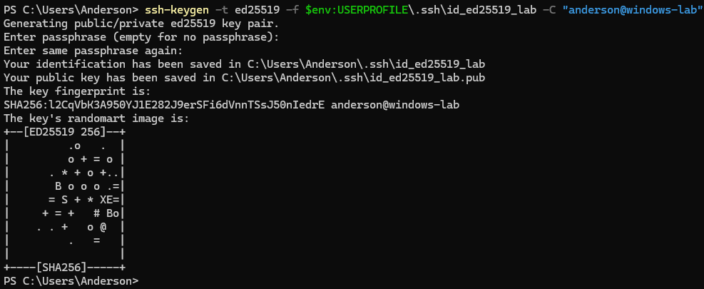

- `-t ed25519`: el tipo de llave, moderno y recomendado.
- `-f`: la ruta y el nombre del archivo, para no pisar la llave existente.
- `-C`: un comentario que identifica la llave y que queda dentro del `authorized_keys`.
- Las dos preguntas de passphrase se dejan vacías (decisión de laboratorio).
- La salida muestra la huella de la llave y su *randomart*, una representación visual de esa huella.

```powershell
dir $env:USERPROFILE\.ssh
```

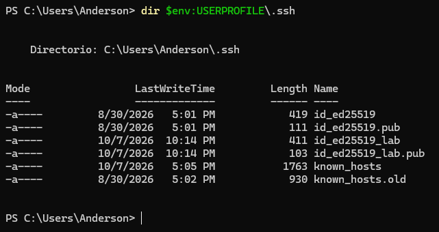

Aparecen `id_ed25519_lab` (la privada, sin extensión) y `id_ed25519_lab.pub` (la pública), junto a los archivos anteriores.

```powershell
type $env:USERPROFILE\.ssh\id_ed25519_lab.pub
```

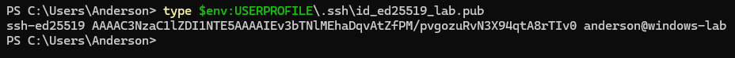

La pública es una sola línea: tipo de llave, la llave y el comentario. Es la única que se muestra y se comparte; la privada no aparece en ninguna captura.

### 3. Copiar la pública al servidor

```powershell
cd $env:USERPROFILE\.ssh
scp .\id_ed25519_lab.pub anderson@IP_SERVIDOR:/home/anderson/
```

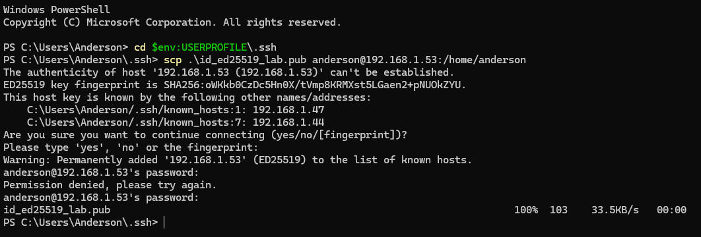

Es la última vez que se usa la contraseña para esto. SSH vuelve a preguntar por la llave del servidor porque la IP es nueva, pero la huella es la misma que ya estaba registrada bajo otras dos IPs: SSH identifica al servidor por su llave, no por su dirección.

### 4. Registrar la llave en el servidor

```bash
mkdir -p ~/.ssh
chmod 700 ~/.ssh
cat ~/id_ed25519_lab.pub >> ~/.ssh/authorized_keys
chmod 600 ~/.ssh/authorized_keys
ls -ld ~/.ssh
ls -l ~/.ssh/authorized_keys
cat ~/.ssh/authorized_keys
```

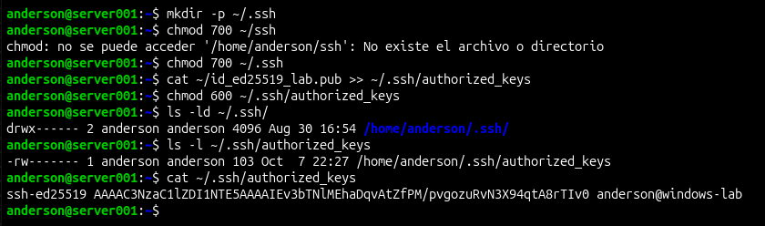

- `>>` **agrega** la llave al final del archivo. Con un solo `>` se borrarían las que ya hubiera.
- Los permisos importan: `~/.ssh` en `700` y `authorized_keys` en `600`. Si son demasiado abiertos, el servidor rechaza la llave.
- La captura muestra `drwx------` y `-rw-------`. El archivo pesa 103 bytes, igual que la `.pub`, y contiene solo esa llave.

### 5. Entrar sin indicar la llave

```powershell
ssh anderson@IP_SERVIDOR
```

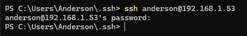

**Pide contraseña**, aunque la llave ya está instalada en el servidor. SSH solo prueba automáticamente las llaves con nombre estándar (`id_ed25519`, `id_rsa`...) o las cargadas en un `ssh-agent`. La llave del laboratorio se llama `id_ed25519_lab`, así que no la prueba. Se cerró con `Ctrl+C`.

### 6. Entrar indicando la llave

```powershell
ssh -i $env:USERPROFILE\.ssh\id_ed25519_lab anderson@IP_SERVIDOR
hostname
exit
```

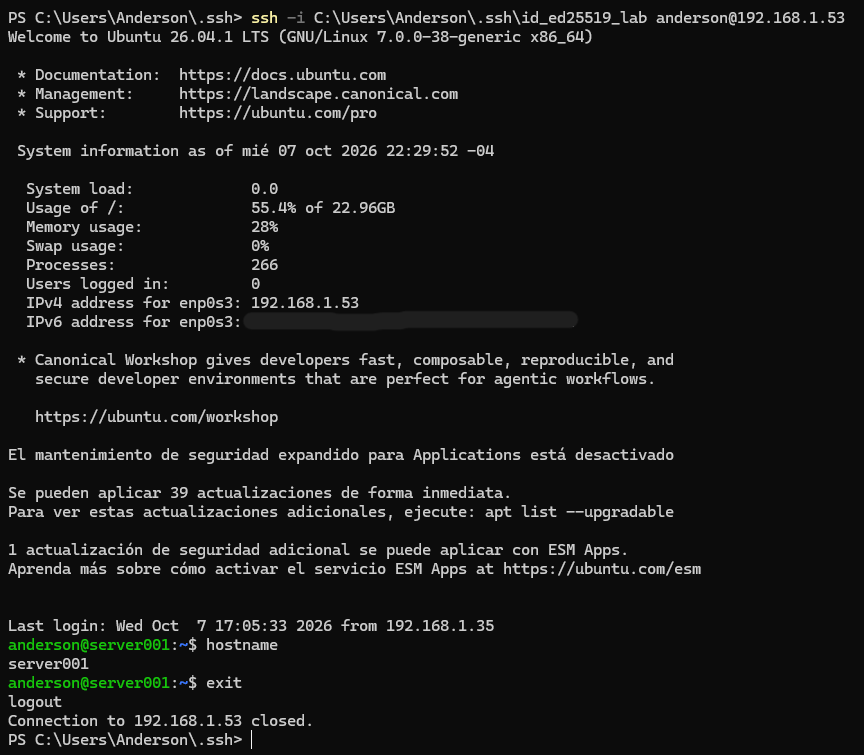

Con `-i` se indica qué privada usar y se entra **sin contraseña**. `hostname` responde `server001`.

---

## 🐧 Parte 2 — VM Debian → servidor

Cada equipo necesita **su propio par**: la privada de Windows no existe en la Debian.

### 7. Estado inicial

```bash
ls -l ~/.ssh
```

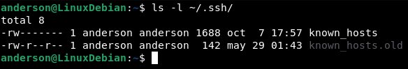

La Debian no tenía ninguna llave (solo `known_hosts` y `known_hosts.old`), así que se parte de cero.

### 8. Generar el par de llaves

```bash
ssh-keygen -t ed25519 -C "anderson@debian-lab"
```

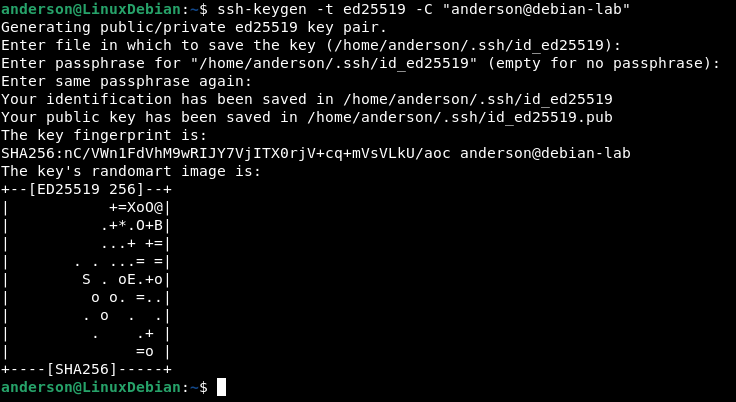

Esta vez se acepta el nombre por defecto (`~/.ssh/id_ed25519`), que SSH probará automáticamente. Passphrase vacía, igual que en Windows.

### 9. Instalar la pública con `ssh-copy-id`

```bash
ssh-copy-id anderson@IP_SERVIDOR
```

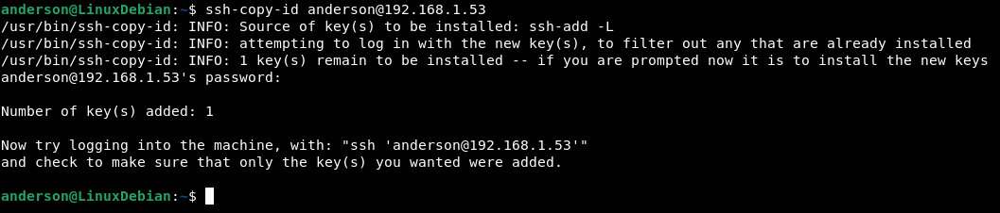

`ssh-copy-id` hace por dentro lo que se hizo a mano en la parte 1: crea `~/.ssh` si falta y agrega la pública a `authorized_keys`. Antes de instalar, intenta entrar con la llave para filtrar las que ya estén instaladas, y no duplica. Termina con `Number of key(s) added: 1`. Pide la contraseña por última vez.

### 10. Entrar sin opciones

```bash
ssh anderson@IP_SERVIDOR
hostname
exit
```

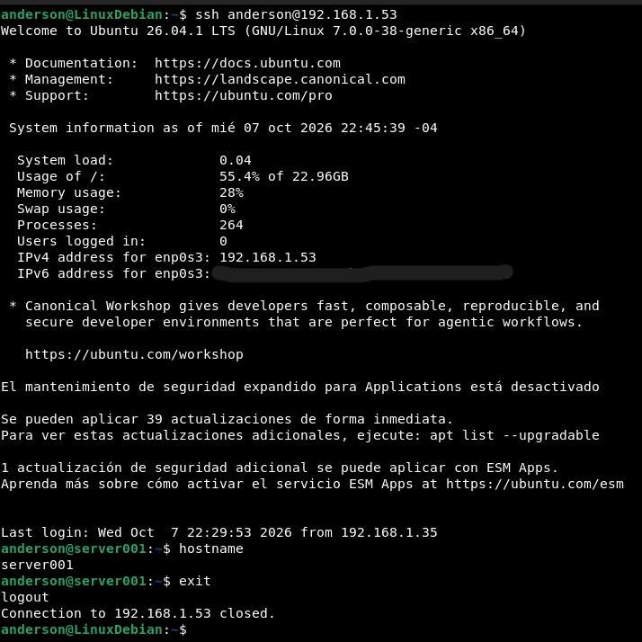

Entra **sin contraseña y sin `-i`**: la llave se llama `id_ed25519`, un nombre estándar. La línea `Last login` corresponde al acceso de Windows de la captura 08 (22:29, desde el equipo Windows).

### 11. Comprobar las llaves autorizadas

```bash
cut -d' ' -f1,3 ~/.ssh/authorized_keys
```

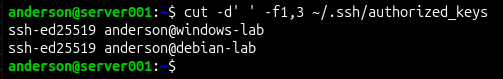

`cut` muestra el tipo y el comentario de cada llave (campos 1 y 3), sin la llave larga. Hay **dos líneas**, una por equipo: `windows-lab` y `debian-lab`. Así se gestiona el acceso: una línea por persona o dispositivo, que se puede borrar para revocarlo.

---

## 📝 Observaciones

1. **El nombre de la llave importa.** En Windows pidió contraseña (captura 07) y en Debian no (captura 12): SSH prueba por sí solo los nombres estándar. Se puede resolver con `-i`, con un archivo `~/.ssh/config` o con `ssh-agent`.
2. **`ssh-copy-id` tomó la llave del `ssh-agent`** (captura 11: `Source of key(s) to be installed: ssh-add -L`) en lugar de leer el archivo `.pub`. No se determinó por qué el agente ya la tenía cargada. Para evitar ambigüedad conviene indicarla: `ssh-copy-id -i ~/.ssh/id_ed25519.pub usuario@ip`.
3. **Passphrase vacía:** decisión de laboratorio. En un entorno real se protege la privada con passphrase (y `ssh-agent` para no reescribirla en cada login), salvo en casos de automatización.
4. **No se desactivó el acceso por contraseña** (`PasswordAuthentication no` en `sshd_config`): queda fuera de esta práctica. En producción se hace después de comprobar las llaves, con una segunda sesión abierta para no quedarse fuera.
5. **La llave de agosto en Windows no se tocó.**
6. **Errores inofensivos en las capturas:** en la 05 hay un `Permission denied` por una contraseña mal escrita, y en la 06 un `chmod` con la ruta mal escrita (`~/ssh`) que se corrige en la línea siguiente.
7. **La IP del servidor cambió otra vez** (ahora `.53`), y SSH la reconoció por su llave. Sigue pendiente configurar IP estática.
