# 🌐 Linux Server — Comandos de red: `ip`, `ping`, `ss` y `tracepath`

Práctica de la sección de redes del curso de administración de Linux Server. Cada comando se ejecutó en el laboratorio y se documenta con su captura y una explicación breve.

## 🖥️ Entorno

- Ubuntu Server 26.04 en VirtualBox (`server001`).
- Interfaz `enp0s3`, red `192.168.1.0/24`, puerta de enlace `192.168.1.1` (todo por DHCP).
- Las capturas **01 a 05** se tomaron antes de bajar y subir la interfaz (IPs `.39` y `.40`). De la **06 en adelante** son posteriores (IP `.41`).
- Por privacidad se ocultaron las MAC, los `altname` y las direcciones IPv6.

## 📋 Resumen de comandos

| Comando | Capa | Para qué sirve |
|---|---|---|
| `ip link show` | 2 | Estado de las interfaces y su MAC |
| `ip link set <if> down/up` | 2 | Apagar o encender una interfaz |
| `ip addr show` | 3 | Direcciones IP y máscara de cada interfaz |
| `ip route` | 3 | Tabla de enrutamiento y puerta de enlace |
| `hostname -I` | 3 | Lista rápida de las IP del equipo |
| `ping` | 3 | Comprobar si se llega a otro equipo (ICMP) |
| `ip neigh` | 2-3 | Vecinos conocidos: relación IP ↔ MAC |
| `ss -tuln` | 4 | Puertos TCP/UDP en escucha |
| `tracepath` | 3 | Saltos hasta un destino y MTU del camino |

### 🔁 Equivalencias con las herramientas antiguas (`net-tools`)

| Antiguo | Moderno |
|---|---|
| `ifconfig` | `ip addr` / `ip link` |
| `route` | `ip route` |
| `arp` | `ip neigh` |
| `netstat` | `ss` |

---

## ⚙️ Parte 1 — Configuración de la red (`ip`)

### 1. Interfaces e IPs (resumen)

```bash
ip -4 -br addr
```

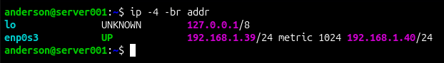

Muestra una línea por interfaz con su estado y sus IPv4 (`-4` solo IPv4, `-br` formato resumido).

- `lo`: loopback, `127.0.0.1/8`. Su estado `UNKNOWN` es normal en una interfaz virtual.
- `enp0s3`: `UP`, con dos IPv4 `/24` (ver *Observaciones* al final).
- `/24` equivale a la máscara `255.255.255.0`, es decir, la red `192.168.1.0/24`.

### 2. Detalle de una interfaz

```bash
ip addr show enp0s3
```

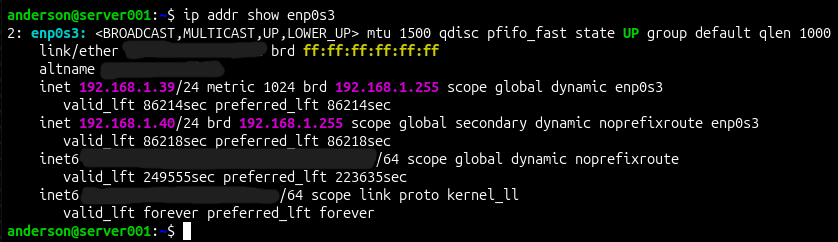

Muestra la configuración IP completa de una interfaz (capa 3).

- `inet 192.168.1.39/24`: IPv4 y máscara.
- `brd 192.168.1.255`: dirección de broadcast de la red (capa 3).
- `scope global`: alcanzable fuera del host. `dynamic`: asignada por DHCP.
- `valid_lft 86214sec`: tiempo que queda de la concesión DHCP (≈ 24 h).
- `secondary`: segunda IPv4 en la misma subred.
- `inet6`: direcciones IPv6 (global y link-local `fe80::`), ocultas en la captura.

### 3. Detalle de capa 2

```bash
ip link show
```

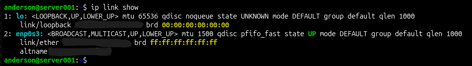

Muestra el estado de las interfaces a nivel de enlace (capa 2).

- `state UP` y flags `UP,LOWER_UP`: `UP` indica que el sistema la tiene activada y `LOWER_UP` que hay enlace físico.
- `mtu 1500` en `enp0s3` y `65536` en `lo`.
- `link/ether`: la MAC (oculta). `brd ff:ff:ff:ff:ff:ff` es el broadcast de capa 2, que no es lo mismo que el broadcast IP `192.168.1.255`.
- `lo` usa `link/loopback` con MAC `00:00:00:00:00:00`: no tiene tarjeta física.

### 4. Tabla de enrutamiento

```bash
ip route
```

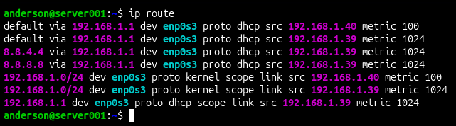

Muestra por dónde se envía el tráfico según su destino.

- `default via 192.168.1.1 dev enp0s3`: puerta de enlace por defecto, por donde sale todo lo que no pertenece a la red local.
- `192.168.1.0/24 dev enp0s3 ... scope link`: red conectada directamente.
- Hay dos rutas por defecto, con métrica 100 (origen `.40`) y 1024 (origen `.39`). Se usa la de **menor métrica**.
- Las rutas a `8.8.8.8` y `8.8.4.4` van hacia los servidores DNS que anuncia el DHCP.

### 5. IPs del host

```bash
hostname -I
```


Lista todas las IP del equipo, sin la loopback ni las link-local. Es un atajo rápido, pero no indica a qué interfaz pertenece cada IP. En la captura se ven las dos IPv4 y, tapada con un recuadro, la IPv6 global.

### 6. Bajar y subir una interfaz

```bash
sudo ip link set enp0s3 down
ip link show enp0s3
sudo ip link set enp0s3 up
ip -4 -br addr
```

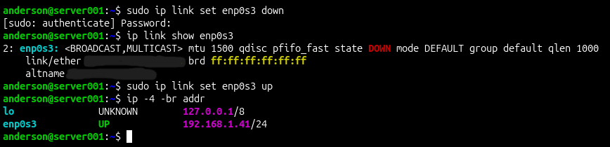

- Con la interfaz caída aparece `state DOWN` y las flags ya no incluyen `UP,LOWER_UP`.
- Justo después de subirla quedó una sola IPv4, `192.168.1.41`, distinta de las anteriores (`.39` y `.40`): el DHCP entrega direcciones nuevas.
- ⚠️ Si estás conectado por SSH a través de esa interfaz, pierdes la sesión. Hazlo desde la consola de VirtualBox.

---

## 🔎 Parte 2 — Diagnóstico de conectividad

`ping` envía paquetes ICMP *echo request* y espera un *echo reply*. Con `-c 4` se limita a cuatro envíos (sin esa opción corre hasta pulsar `Ctrl+C`). El diagnóstico se hace **de adentro hacia afuera**: uno mismo → router → internet.

### 7. Ping al loopback

```bash
ping -c 4 127.0.0.1
```

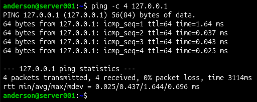

- 0 % de pérdida y ≈ 0.03 ms por paquete (el primero, 1.64 ms, suele ser más lento). TTL 64.
- El tráfico a `127.0.0.1` nunca sale del equipo: no usa tarjeta ni cable. Comprueba que la pila TCP/IP local funciona, y responde incluso con la interfaz física caída.

### 8. Ping a la puerta de enlace

```bash
ping -c 4 192.168.1.1
```

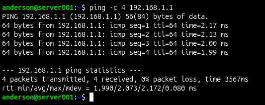

- ≈ 2 ms, TTL 64 y 0 % de pérdida: el router está a un salto, dentro de la LAN.
- Comprueba que el servidor llega a su red local.

### 9. Ping a internet

```bash
ping -c 4 8.8.8.8
```

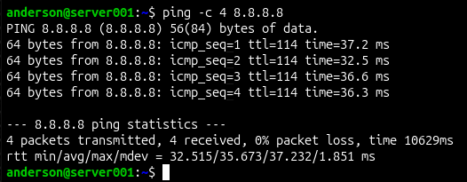

- ≈ 36 ms y 0 % de pérdida. `8.8.8.8` es un DNS público de Google.
- Se usa una IP y no un nombre, así que la prueba no depende del DNS.
- TTL 114: la respuesta cruzó varios routers (cada uno resta 1 al valor inicial).

### 10. Vecinos de la red (ARP)

```bash
ip neigh
```

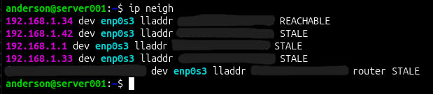

Tabla de vecinos: relación IP ↔ MAC de los equipos con los que se ha comunicado (ARP en IPv4, NDP en IPv6).

- `REACHABLE`: confirmado recientemente. `STALE`: guardado, pero sin confirmar desde hace un rato (no es un error).
- Aparecen el gateway `192.168.1.1`, otros tres equipos de la LAN y, con la etiqueta `router`, el router por IPv6.
- MAC e IPv6 ocultas.

### 11. Puertos en escucha

```bash
ss -tuln
```

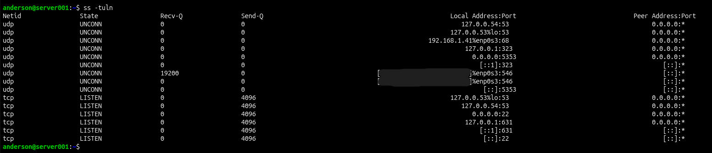

Opciones: `-t` TCP, `-u` UDP, `-l` solo puertos en escucha, `-n` números en lugar de nombres.

| Puerto | Qué es | Quién puede conectarse |
|---|---|---|
| 22/tcp | SSH | Cualquier interfaz (`0.0.0.0` y `[::]`) |
| 53 | DNS local (systemd-resolved) | Solo el propio servidor |
| 631/tcp | Impresión (IPP) | Solo el propio servidor |
| 323/udp | chrony (control local) | Solo el propio servidor |
| 68 y 546/udp | Cliente DHCP (IPv4 e IPv6) | Interfaz de red |
| 5353/udp | mDNS | Cualquier interfaz |

Regla de lectura: `127.0.0.x` o `::1` significa que solo es accesible desde el propio servidor; `0.0.0.0` o `[::]`, que escucha en todas las interfaces. Esta captura es posterior a bajar y subir la interfaz, por eso muestra la IP `.41`. Las IPv6 están ocultas.

### 12. Ruta hasta un destino

```bash
tracepath 8.8.8.8
```

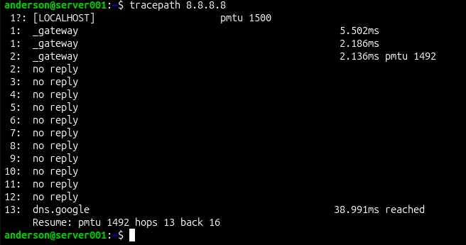

Muestra los saltos hasta el destino y la MTU del camino (PMTU).

- Salto 1: `_gateway` (`192.168.1.1`); el nombre lo asigna el propio sistema.
- Saltos 2 a 12 en `no reply`: muchos routers no responden a este tipo de sondeo, es normal.
- Llega a `dns.google` en 13 saltos (≈ 39 ms).
- `pmtu 1492`: el camino admite paquetes algo menores que el MTU 1500 de la interfaz (valor habitual en conexiones PPPoE, no verificado en este caso).

---

## 📝 Observaciones

1. **Dos IPv4 en una interfaz.** `enp0s3` tiene dos direcciones dinámicas en la misma subred y dos rutas por defecto con métricas distintas. Causa probable, según los logs revisados: dos clientes DHCP activos a la vez (NetworkManager y systemd-networkd), cada uno pidiendo su propia IP. No se corrigió; se retomará al ver IP estática y netplan.
2. **`ping` a internet (captura 09).** `time 10629ms` es el tiempo total del comando; con `-c 4` suele rondar los 3000 ms. Cada respuesta tardó ≈ 36 ms. Causa no determinada.
3. **`ss -tuln` (captura 11).** Un socket UDP del puerto 546 muestra `Recv-Q` 19200, mientras casi todo lo demás está en 0. No investigado.
