# 📂 Linux Server — Transferencia de archivos por SSH (Bitvise, `scp` y `rsync`)

Práctica de la sección de administración del curso de Linux Server. Se transfieren archivos entre un servidor Linux y dos clientes (Windows y otra VM Linux), en ambos sentidos, con tres herramientas. Cada paso va con su captura y una explicación breve.

## 🖥️ Entorno

- **Servidor:** Ubuntu Server 26.04 (`server001`) en VirtualBox, con SSH en el puerto 22.
- **Cliente 1:** Windows, con Bitvise SSH Client y PowerShell (OpenSSH).
- **Cliente 2:** VM Debian (`LinuxDebian`), en la misma red `192.168.1.0/24`.
- **Archivos de prueba:** `~/pruebas-transferencia/` (`scp` y Bitvise) y `~/sync-origen/` y `~/sync-destino/` (`rsync`).
- La IP del servidor cambió por DHCP entre bloques: `192.168.1.44` en las capturas 01 a 16 y `192.168.1.50` de la 19 en adelante. En los comandos de explicación se usa `IP_SERVIDOR`.

## 📋 Resumen de herramientas

Ninguna necesita un servicio nuevo en el servidor: todas viajan **por SSH** (puerto 22, tráfico cifrado, mismas credenciales).

| Herramienta | Desde | Cómo funciona | Cuándo usarla |
|---|---|---|---|
| **Bitvise** | Windows | Cliente gráfico que transfiere con SFTP; se arrastra y se suelta | Transferencias puntuales y visuales |
| **`scp`** | Windows (PowerShell) y Linux | Copia con `ORIGEN DESTINO` | Un archivo suelto o una carpeta (`-r`) |
| **`rsync`** | Linux ↔ Linux (instalado en ambos extremos) | Sincroniza: compara y envía solo lo que cambió | Copias repetidas y backups |

**Cómo se leen los comandos**

- En `scp` y `rsync`, el orden es siempre `ORIGEN DESTINO`. Lo que lleva `usuario@ip:` delante es el servidor, y su posición marca la dirección: si va **segundo** es una subida, si va **primero** es una bajada.
- `rsync -avh --progress`: `-a` es modo archivo (recursivo, conserva permisos, fechas y enlaces), `-v` da detalle, `-h` muestra tamaños legibles y `--progress` el avance.
- `rsync -n` **simula** sin copiar nada.
- La barra final de `ORIGEN/` en `rsync` copia el **contenido**; sin ella, copia la carpeta entera dentro del destino.

---

## 🪟 Parte 1 — Windows ↔ servidor

### 1. Bitvise: subir archivos (Windows → servidor)

Bitvise abre una ventana SFTP con dos paneles: el local (Windows) y el remoto (servidor). Primero, la carpeta remota está vacía:

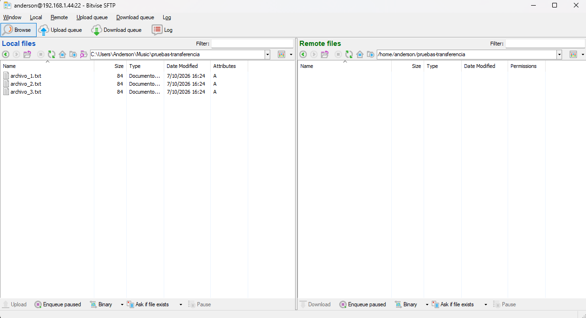

Se arrastran los tres archivos al panel remoto (`Upload status: 3 items transferred`):

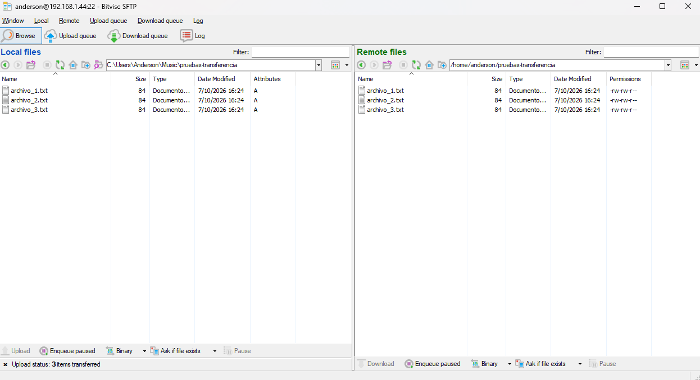

Se verifica en el servidor con `ls -l` y `cat`: llegaron los tres, de 84 bytes cada uno, igual que en Windows.

```bash
ls -l ~/pruebas-transferencia
cat ~/pruebas-transferencia/*
```

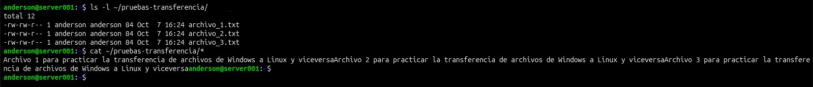

### 2. Bitvise: bajar archivos (servidor → Windows)

Se crea un archivo en el servidor para bajarlo:

```bash
echo "Archivo desde el servidor" > ~/pruebas-transferencia/desde_servidor.txt
ls -l ~/pruebas-transferencia
```

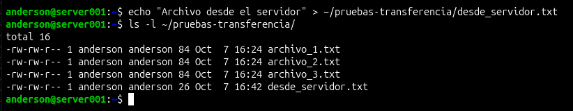

Se arrastra del panel remoto al local (`Download status: 1 item transferred`):

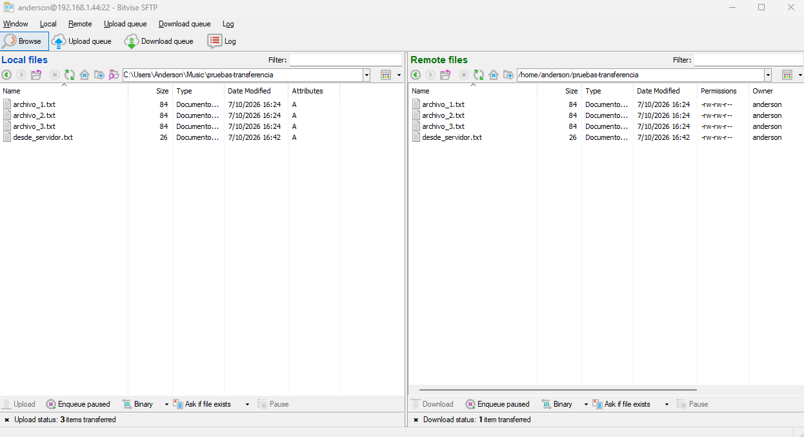

Se verifica en PowerShell:

```powershell
dir
type .\desde_servidor.txt
```

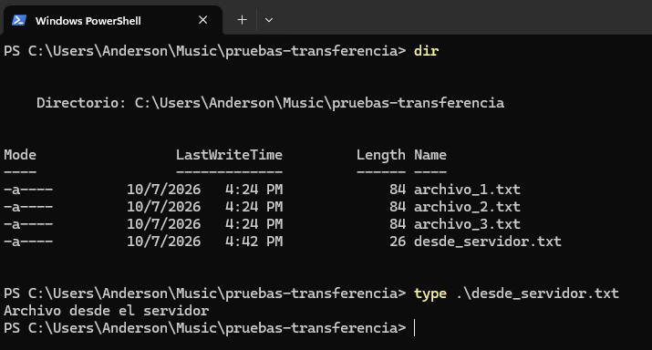

### 3. `scp` desde PowerShell: subir

```powershell
scp .\archivo_4.txt anderson@IP_SERVIDOR:/home/anderson/pruebas-transferencia/
```

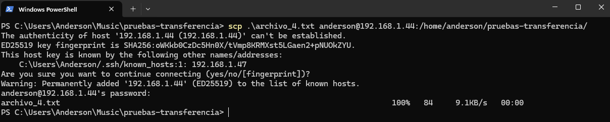

La primera vez, SSH pide confirmar la llave del servidor (`yes`). Luego muestra el avance hasta `100%`.

Verificación en el servidor (el archivo tiene 84 bytes y el contenido esperado):

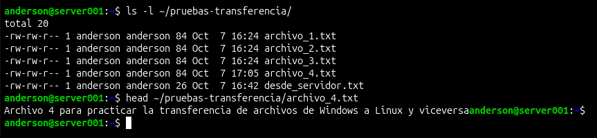

### 4. `scp` desde PowerShell: bajar

Se crea un archivo en el servidor:

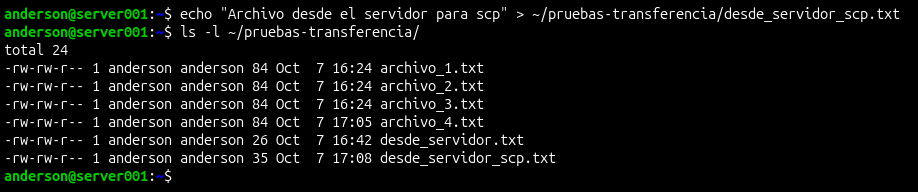

Y se baja a la carpeta actual (el punto final significa "aquí"):

```powershell
scp anderson@IP_SERVIDOR:/home/anderson/pruebas-transferencia/desde_servidor_scp.txt .
```

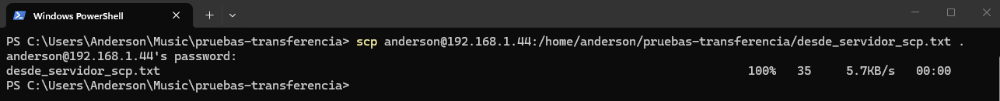

Verificación en Windows:

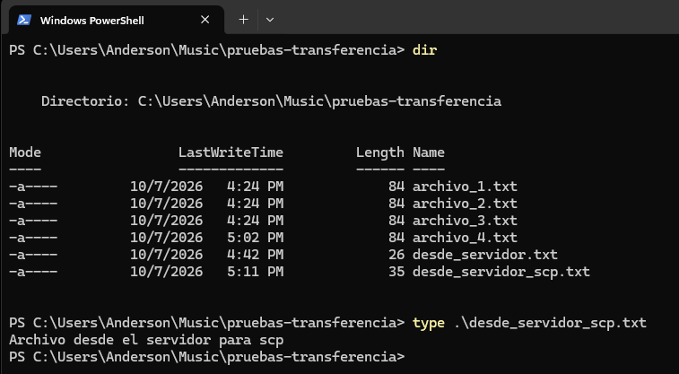

---

## 🐧 Parte 2 — VM Linux ↔ servidor

### 5. Conectividad previa

Antes de transferir, se comprueba que la VM y el servidor se ven en la misma red:

```bash
ip -4 -br addr
ping -c 4 IP_SERVIDOR
```

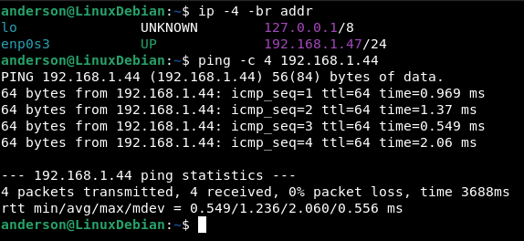

### 6. `scp` desde Linux: subir

```bash
scp ~/pruebas-transferencia/archivo_5.txt anderson@IP_SERVIDOR:/home/anderson/pruebas-transferencia/
```

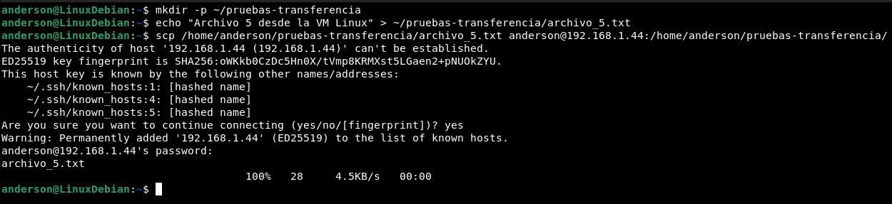

Es la primera conexión desde esta VM, así que SSH pregunta por la llave del servidor. Verificación en el servidor:

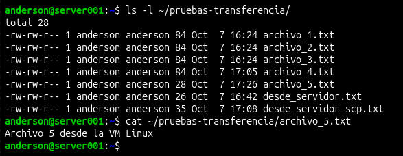

### 7. `scp` desde Linux: bajar

```bash
scp anderson@IP_SERVIDOR:/home/anderson/pruebas-transferencia/archivo_1.txt ~/pruebas-transferencia/
```

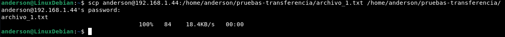

Verificación en la VM:

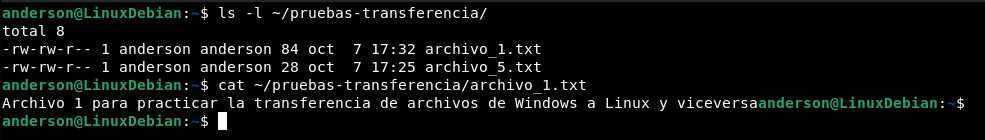

### 8. `rsync`: comprobar que está instalado en ambos extremos

`rsync` debe existir en el origen **y** en el destino. Las versiones difieren (3.5.0 y 3.4.1), pero ambas usan el mismo protocolo (32).

```bash
rsync --version | head -1
```

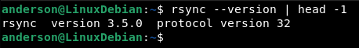

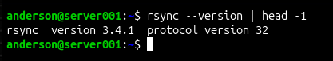

### 9. `rsync`: simular y copiar (VM → servidor)

Primero se simula con `-n`: lista lo que se enviaría y termina con `(DRY RUN)`, sin copiar nada.

```bash
rsync -avhn --progress ~/sync-origen/ anderson@IP_SERVIDOR:/home/anderson/sync-destino/
```

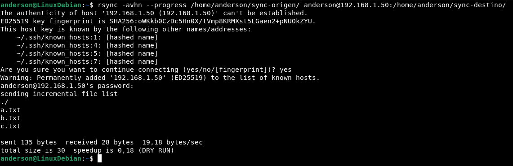

Después, el mismo comando sin la `n` hace la copia real:

```bash
rsync -avh --progress ~/sync-origen/ anderson@IP_SERVIDOR:/home/anderson/sync-destino/
```

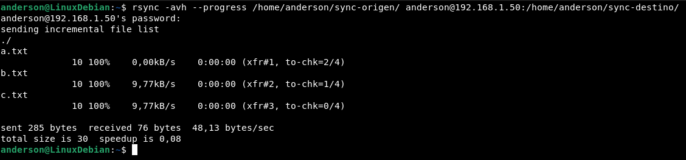

Verificación en el servidor:

```bash
ls -lt ~/sync-destino/
```

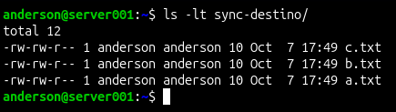

### 10. `rsync`: enviar solo lo que cambió

Se modifica `b.txt` y se crea `d.txt` en el origen, y se repite el mismo comando:

```bash
echo "B modificado" >> ~/sync-origen/b.txt
echo "Archivo D" > ~/sync-origen/d.txt
```

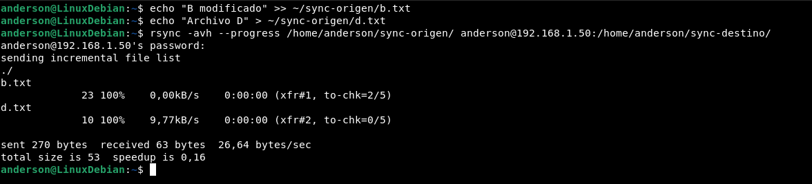

Solo se enviaron `b.txt` (23 bytes) y `d.txt` (10 bytes). `a.txt` y `c.txt` no se tocaron. Verificación en el servidor:

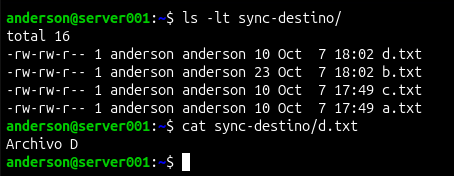

### 11. `rsync`: bajar (servidor → VM)

Se preparan dos archivos en el servidor:

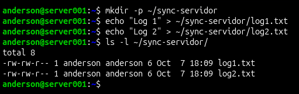

Simulación y copia real. Ahora el servidor va **primero** (origen), así que es una bajada:

```bash
rsync -avhn --progress anderson@IP_SERVIDOR:/home/anderson/sync-servidor/ ~/sync-bajada/
rsync -avh --progress anderson@IP_SERVIDOR:/home/anderson/sync-servidor/ ~/sync-bajada/
```

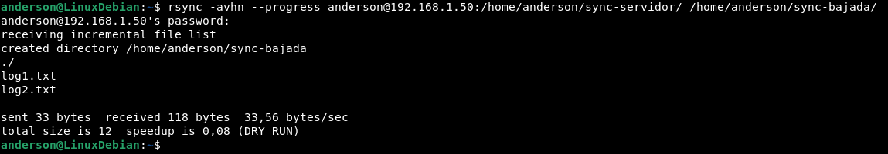

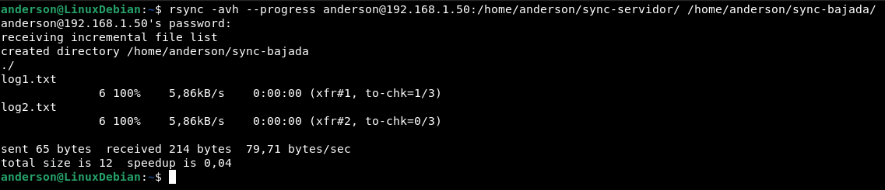

Verificación en la VM:

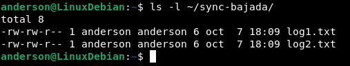

---

## 📝 Observaciones

1. **La IP del servidor cambió entre pruebas** (`.44` y luego `.50`) por ser dinámica (DHCP). Es un argumento para configurar IP estática, tema pendiente.
2. **SSH reconoce al servidor por su llave, no por su IP.** La huella de la llave es la misma desde Windows, desde la VM y con las distintas IPs (capturas 07, 13 y 19). En la 07, SSH la reconoció bajo `192.168.1.47`, que después aparece como IP de la VM (captura 12). Posiblemente el router reasignó esa IP; no se verificó.
3. **Fechas de modificación.** Con `scp` se ve que **no se conservan**: los archivos llegan con la hora de la copia (por ejemplo, 17:25 en la VM y 17:26 en el servidor, o 16:24 y 17:32 en el sentido contrario). Con Bitvise y `rsync -a` las fechas parecen conservarse, pero `ls -l` y Bitvise solo muestran minutos, así que no es concluyente. `scp -p` conserva fechas y permisos, y no se probó.
4. **`cat` pega los archivos de prueba** (capturas 03, 08 y 16): terminan sin salto de línea final, así que el siguiente texto o el prompt queda pegado.
5. **`speedup` menor que 1** (0,16, 0,08 y 0,04 en las capturas 22, 20 y 26). Compara el tamaño total con los bytes que viajan, y con archivos de unos pocos bytes pesa más el protocolo que los datos. No se probó con archivos grandes.
6. **La simulación no crea nada.** Las capturas 25 y 26 muestran `created directory ...`: la simulación lo anuncia, pero la copia real vuelve a anunciarlo, así que la carpeta no existía.

