# ACL Estándar — Topología Empresarial en Malla Parcial

Laboratorio práctico para demostrar el dominio de **ACL estándar** en Cisco IOS: wildcard masks continuas, discontinuas, fragmentación de rango, excepciones puntuales, ACL numeradas y nombradas, `host`, `any` y `remark`, sobre una topología con enrutamiento dinámico (RIPv2) y redundancia de enlaces (malla parcial).

## Archivo de topología

[ACL_estandar.pkt](./ACL_estandar.pkt) — archivo de Packet Tracer con la topología completa, lista para abrir y probar.

## Objetivo

Simular la red interna de una empresa con 6 departamentos, donde cada uno tiene control de acceso hacia otros departamentos según reglas de negocio (mínimo privilegio, excepciones puntuales, subconjuntos de usuarios autorizados), sin aplicar seguridad administrativa, VLANs, NTP ni VTP — el foco es exclusivamente ACL estándar + RIPv2.

## Topología

Malla parcial (anillo + 2 diagonales) para garantizar más de un camino posible entre LANs:

```
        R1 ---- R2
       /  |      |  \
      /   |      |   \
    R6    |      |    R3
      \   |      |   /
       \  |      |  /
        R5 ---- R4
```

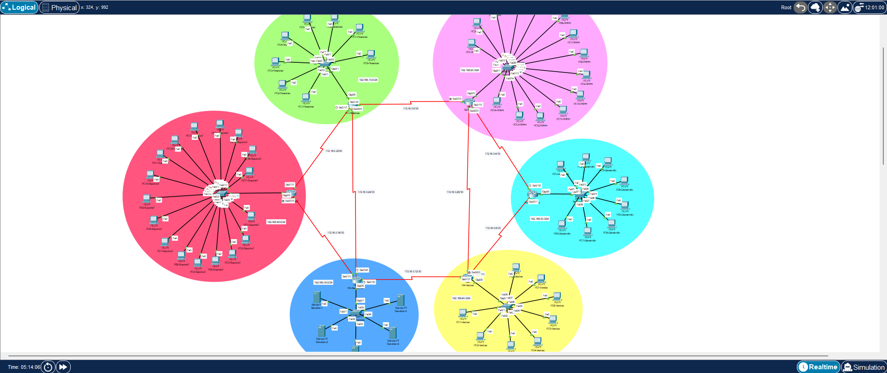

**Enlaces WAN:** R1–R2, R2–R3, R3–R4, R4–R5, R5–R6, R6–R1 (anillo) + R1–R5, R2–R4 (diagonales)

Cada router tiene una LAN propia con switch y PCs.

## Direccionamiento IP

### LANs

| Router | Departamento | Red LAN | Gateway |
|---|---|---|---|
| R1 | Finanzas / Contabilidad | 192.168.10.0/24 | 192.168.10.254 |
| R2 | Recursos Humanos | 192.168.20.0/24 | 192.168.20.254 |
| R3 | Desarrollo / Ingeniería | 192.168.30.0/24 | 192.168.30.254 |
| R4 | Ventas | 192.168.40.0/24 | 192.168.40.254 |
| R5 | Servidores / Datacenter interno | 192.168.50.0/24 | 192.168.50.254 |
| R6 | IT / Soporte técnico | 192.168.60.0/24 | 192.168.60.254 |

### Enlaces WAN (/30)

| Enlace | Red |
|---|---|
| R1–R2 | 172.16.0.0/30 |
| R2–R3 | 172.16.0.4/30 |
| R3–R4 | 172.16.0.8/30 |
| R4–R5 | 172.16.0.12/30 |
| R5–R6 | 172.16.0.16/30 |
| R6–R1 | 172.16.0.20/30 |
| R1–R5 | 172.16.0.24/30 |
| R2–R4 | 172.16.0.28/30 |

## Enrutamiento

RIPv2 en los 6 routers, con `no auto-summary` (obligatorio por el uso de subredes /30 classless en los enlaces WAN) y `passive-interface` en cada interfaz LAN.

## Escenario de negocio y políticas de seguridad

### Política 1 — R1 (Finanzas)

Finanzas maneja información sensible (nóminas, balances). Ventas no tiene motivo de negocio para acceder, salvo el gerente de Ventas, que sí necesita revisar comisiones y reportes de cierre.

```
access-list 1 remark permitir trafico al gerente de ventas
access-list 1 permit host 192.168.40.5
access-list 1 remark bloquear trafico al resto de la red 192.168.40.0/24
access-list 1 deny 192.168.40.0 0.0.0.255
access-list 1 remark permitir trafico al resto de las redes
access-list 1 permit any
```

Aplicada en `GigabitEthernet0/0 out` (LAN de Finanzas).

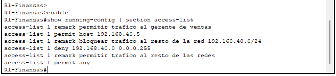

### Política 2 — R3 (Desarrollo)

RRHH no necesita acceso a Desarrollo, salvo el equipo de reclutamiento técnico ("Talent Tech"), representado por las IPs pares del bloque 192.168.20.0-.14 — una wildcard discontinua.

```
ip access-list standard BLOQUEO-RRHH
 remark permitir un subconjunto para (0-14) de RRHH
 permit 192.168.20.0 0.0.0.14
 remark bloquear resto del trafico de RRHH
 deny 192.168.20.0 0.0.0.255
 remark permitir trafico de las demas redes
 permit any
```

Aplicada en `GigabitEthernet0/0 out` (LAN de Desarrollo).

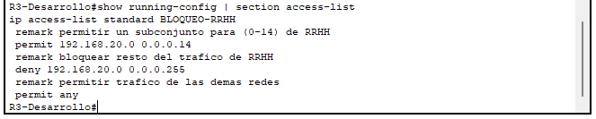

### Política 3 — R5 (Servidores / Datacenter interno)

Único departamento con acceso: IT, y solo el subconjunto de administradores de sistemas senior (primeras 13 IPs de su LAN, .0 a .12). Mínimo privilegio total: nadie más accede, ni siquiera el resto de IT.

```
ip access-list standard BLOQUEO-SERVIDORES
 remark permitir el acceso solo a un conjunto de Soporte Tecnico
 permit 192.168.60.0 0.0.0.7
 permit 192.168.60.8 0.0.0.3
 permit host 192.168.60.12
 remark bloquear el acceso al resto de las redes
 deny any
```

Aplicada en `GigabitEthernet0/0 out` (LAN de Servidores). Rango de 13 IPs logrado por **fragmentación de rango** (8 + 4 + 1), sin `permit any` final.

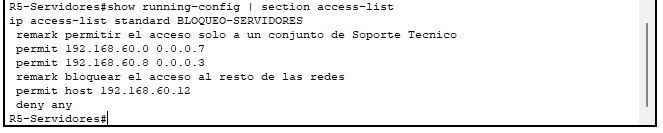

### Política 4 — R6 (IT / Soporte técnico)

RRHH no tiene acceso directo a IT, salvo dos hosts de coordinación (gerente de RRHH y enlace de onboarding/offboarding). El resto de la empresa mantiene acceso libre a IT.

```
access-list 1 remark permitir acceso a equipo de gerencia de RRHH
access-list 1 permit host 192.168.20.5
access-list 1 permit host 192.168.20.10
access-list 1 remark bloquear el trafico del resto de la red de RRHH
access-list 1 deny 192.168.20.0 0.0.0.255
access-list 1 remark permitir trafico entre el resto de redes
access-list 1 permit any
```

Aplicada en `GigabitEthernet0/0 out` (LAN de IT).

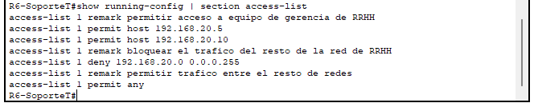

## Técnicas de ACL demostradas

| Técnica | Router |
|---|---|
| Wildcard continua (bloque) | R1, R6 |
| Wildcard discontinua | R3 |
| Fragmentación de rango | R5 |
| Excepción puntual (`host`) | R1, R6 |
| ACL numerada | R1, R6 |
| ACL nombrada | R3, R5 |
| `remark` documentando intención | Los 4 routers |
| `deny any` explícito (mínimo privilegio) | R5 |
| `permit any` implícito de cierre | R1, R3, R6 |

## Criterio de ubicación de las ACL

Las 4 ACL se aplican en la interfaz LAN del router destino, sentido `out` — norma estándar de "ACL estándar cerca del destino". Esto garantiza que el filtrado capture el tráfico sin importar la ruta que tome (la malla parcial ofrece más de un camino posible entre varias LANs).

## Verificación

### Contadores de coincidencias (`show access-lists`)

Cada ACL con matches reales, confirmando que el filtrado está activo y en uso:

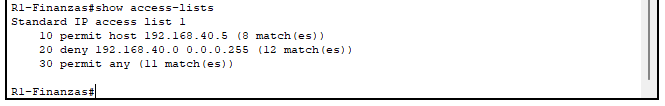
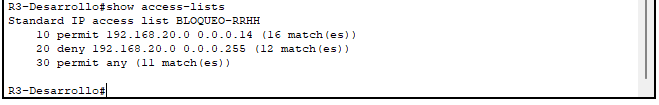
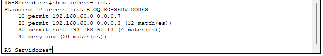
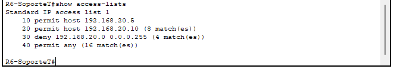

### Prueba de tráfico (ping)

**Política 1 — Finanzas:** el gerente de Ventas (host exceptuado) accede; el resto de Ventas queda bloqueado.

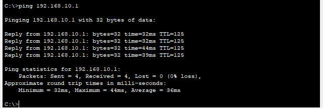
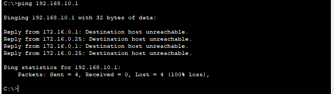

**Política 3 — Servidores:** un administrador senior de IT (dentro del rango .0–.12) accede; un host de IT fuera de ese rango queda bloqueado, confirmando el mínimo privilegio total de esta política.

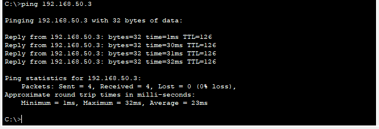
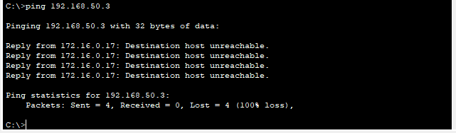
