# ACL Extendidas — Corporación Andina de Tecnología (CAT)

Laboratorio de práctica sobre **ACL extendidas** en Cisco IOS, implementado en Packet Tracer. Simula la red de una empresa ficticia con 5 sedes/departamentos interconectados en malla parcial con redundancia, usando ACLs extendidas, nombradas y numeradas, para controlar el acceso a servidores web, SSH de administración y aislamiento entre departamentos.

Este proyecto es la continuación del laboratorio de [ACL estándar](../acl-estandar) dentro de esta bitácora.

## Archivo de topología

[ACL_extendida.pkt](./ACL_extendida.pkt) — archivo de Packet Tracer con la topología completa, lista para abrir y probar.

## Topología

5 routers Cisco 1941 conectados en anillo, con un enlace diagonal adicional para dar redundancia de ruta (RIPv2 como protocolo de enrutamiento). Cada router tiene su propia LAN (switch 2960 + PCs) representando un departamento de la empresa.

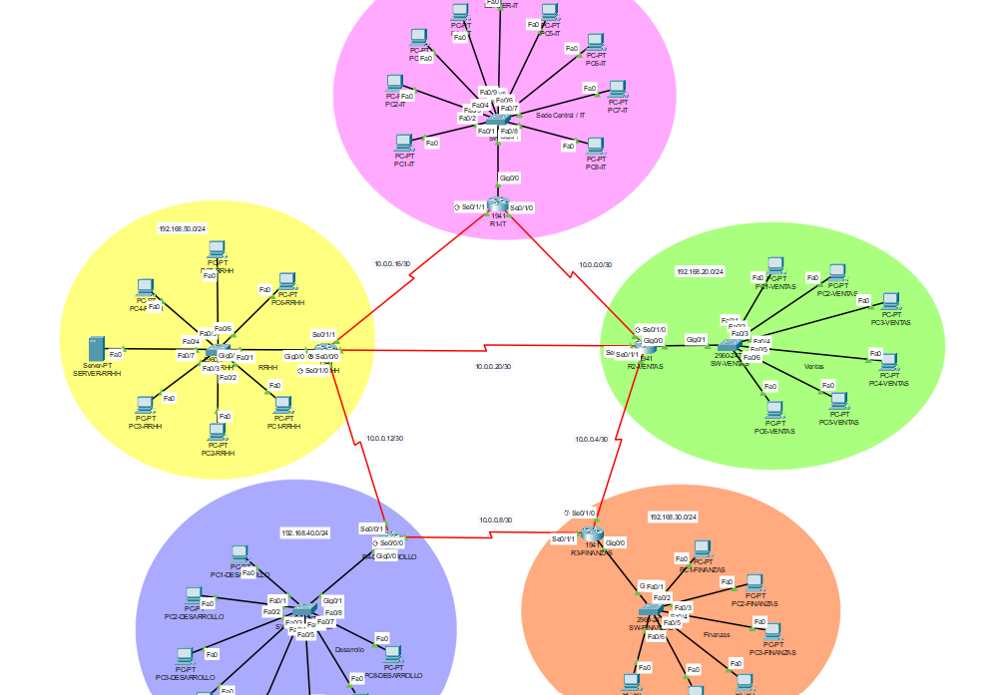

| Router | Departamento | LAN |
|---|---|---|
| R1-IT | Sede Central / IT | 192.168.10.0/24 |
| R2-VENTAS | Ventas | 192.168.20.0/24 |
| R3-FINANZAS | Contabilidad y Finanzas | 192.168.30.0/24 |
| R4-DESARROLLO | Desarrollo | 192.168.40.0/24 |
| R5-RRHH | Recursos Humanos | 192.168.50.0/24 |

**Servidores**
- **Portal Intranet** — `192.168.10.10` (LAN de R1), HTTP y HTTPS habilitados. Accesible para toda la empresa.
- **Sistema de RRHH** — `192.168.50.10` (LAN de R5), solo HTTPS habilitado. Contiene información sensible de empleados.

**Host administrador**
- `192.168.10.50`, en la LAN de R1. Único equipo autorizado para acceder por SSH a la gestión de los 5 routers.

**Credenciales de laboratorio**
- Usuario SSH / enable: `anderson`
- Contraseña: `anderson`

## Políticas de seguridad implementadas

1. **Portal Intranet de acceso general.** Todos los departamentos pueden acceder al Portal Intranet solo por HTTP y HTTPS. Cualquier otro tipo de tráfico hacia ese servidor se bloquea.
2. **Sistema de RRHH restringido.** Solo la propia LAN de RRHH y el departamento de IT pueden acceder al Sistema de RRHH, y únicamente por HTTPS. El resto de la empresa no tiene ningún tipo de acceso a ese servidor, ni siquiera ping.
3. **Gestión remota centralizada.** El acceso SSH a cualquier router de la empresa está limitado exclusivamente al host `192.168.10.50`.
4. **Aislamiento Ventas–Desarrollo.** Ningún tipo de tráfico, en ningún sentido, entre la LAN de Ventas y la LAN de Desarrollo.
5. **Diagnóstico general.** El ping entre departamentos funciona libremente, salvo las excepciones ya establecidas en las políticas 2 y 4.
6. **Telnet bloqueado hacia Finanzas.** Ningún otro departamento puede iniciar una sesión Telnet contra la LAN de Contabilidad/Finanzas.

## Diseño de las ACLs

Todas las ACLs extendidas se aplican **lo más cerca posible del origen del tráfico que controlan**, siguiendo la buena práctica de Cisco para este tipo de ACL. La ACL de acceso SSH, al ser estándar, se aplica sobre las líneas `vty` de cada router.

### Política 1 — Portal Intranet (R2, R3, R4, R5 — interfaz LAN, sentido `in`)

```
permit tcp any host 192.168.10.10 eq 80
permit tcp any host 192.168.10.10 eq 443
deny ip any host 192.168.10.10
permit ip any any
```

No se aplica en R1: el tráfico de los demás departamentos ya queda filtrado en su router de origen antes de llegar a R1, e IT es el dueño del servidor.

### Política 2 — Sistema de RRHH (R5 — interfaz LAN, sentido `out`)

```
permit tcp 192.168.10.0 0.0.0.255 host 192.168.50.10 eq 443
deny ip any host 192.168.50.10
permit ip any any
```

Se aplica en sentido `out` porque, gracias a la redundancia de la topología, el tráfico externo puede llegar a R5 por más de una ruta; filtrando justo antes de entregarlo a la LAN se cubren todas las rutas posibles.

### Política 3 — Acceso SSH (R1 a R5 — líneas vty)

ACL estándar nombrada, misma configuración en los 5 routers:

```
ip access-list standard ACCESO_SSH
 permit host 192.168.10.50

line vty 0 4
 access-class ACCESO_SSH in
```

### Política 4 — Aislamiento Ventas–Desarrollo (R2 y R4 — interfaz LAN, sentido `in`)

Se integra como una línea adicional dentro de la misma ACL de la política 1, antes del `permit ip any any` final.

En R2 (Ventas):
```
deny ip any 192.168.40.0 0.0.0.255
```

En R4 (Desarrollo):
```
deny ip any 192.168.20.0 0.0.0.255
```

Se filtra en el origen de cada lado para que el bloqueo sea efectivo sin importar la ruta que tome el tráfico dentro de la malla redundante.

### Política 6 — Telnet hacia Finanzas (R3 — interfaz LAN, sentido `out`)

ACL numerada, para practicar también esta sintaxis dentro del mismo proyecto:

```
access-list 100 deny tcp any 192.168.30.0 0.0.0.255 eq telnet
access-list 100 permit ip any any
```

> La política 5 (ping general permitido) no requirió una ACL propia: es consecuencia de que las demás ACLs solo tienen `deny` puntuales, y todo lo demás cae en el `permit ip any any` final de cada una.

## Configuración final por router

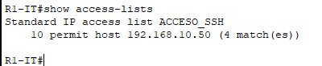
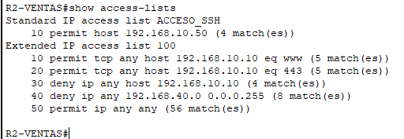
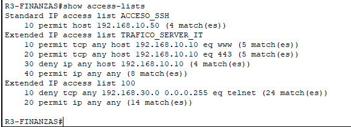
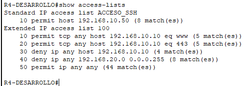
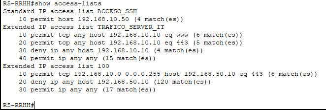

## Pruebas realizadas

Cada política se verificó con un caso permitido y un caso bloqueado, confirmando el resultado en los contadores de `show access-lists`.

| # | Prueba | Resultado esperado |
|---|---|---|
| 1 | PC de otro departamento abre `http://192.168.10.10` y `https://192.168.10.10` | Permitido |
| 2 | Esa misma PC hace ping a `192.168.10.10` | Bloqueado |
| 3 | Ping entre una PC de Ventas y una de Desarrollo | Bloqueado en ambos sentidos |
| 4 | SSH desde `192.168.10.50` hacia cualquier router | Permitido |
| 5 | SSH desde cualquier otra PC hacia un router | Bloqueado |
| 6 | Telnet desde otro departamento hacia `192.168.30.254` | Bloqueado |
| 7 | PC de IT abre `https://192.168.50.10` | Permitido |
| 8 | PC de IT intenta `http://192.168.50.10` o hace ping a esa IP | Bloqueado |
| 9 | PC de Ventas o Finanzas intenta cualquier acceso a `192.168.50.10` | Bloqueado |

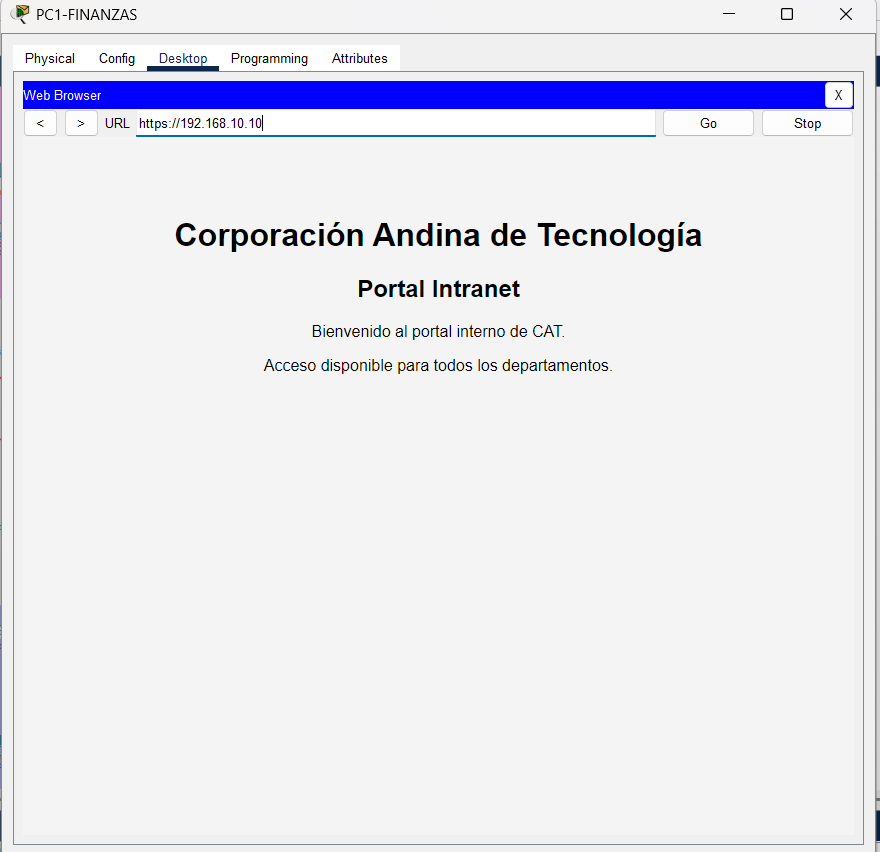
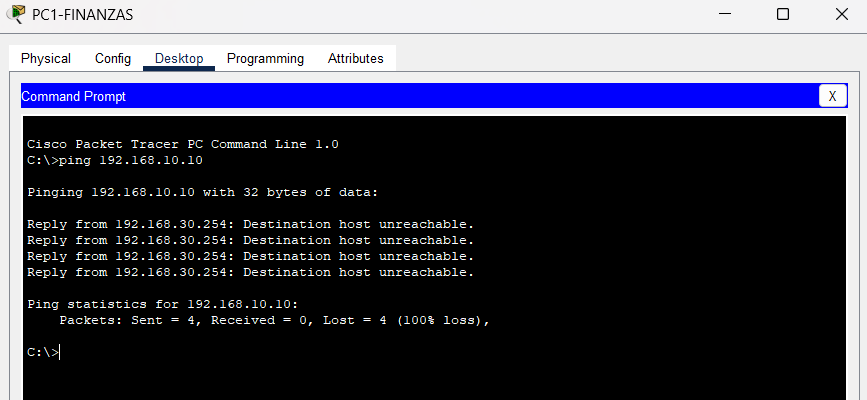
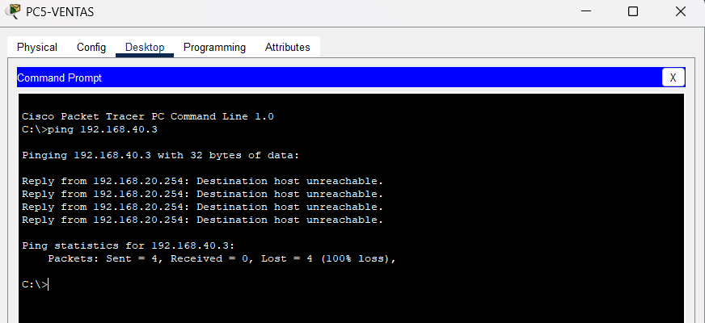
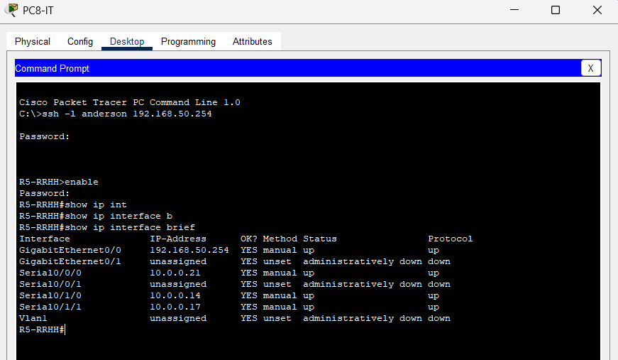
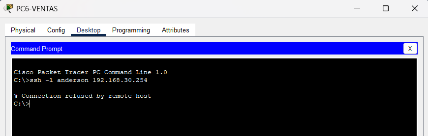
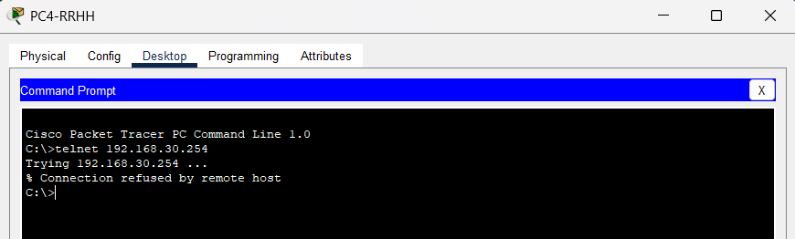
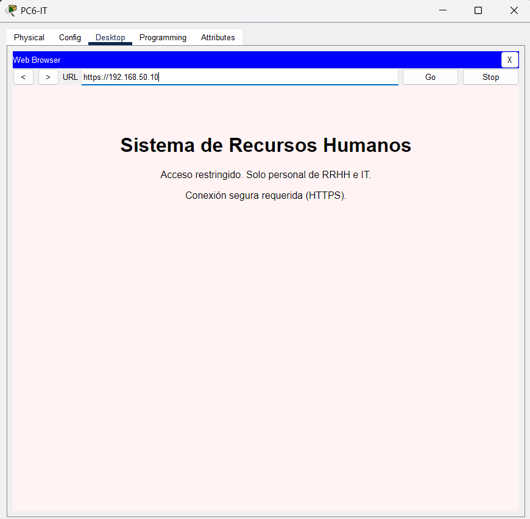
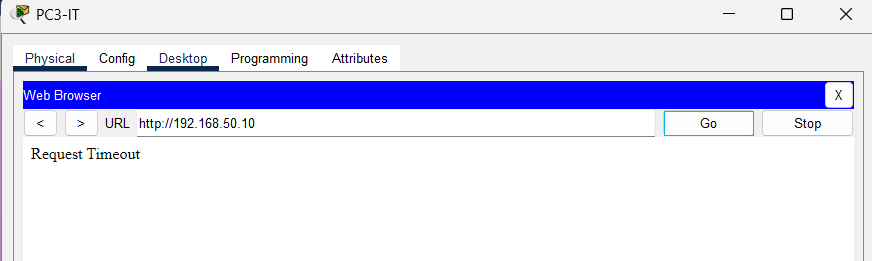

## Conceptos practicados

- Sintaxis de ACL extendida numerada y nombrada
- Filtrado por protocolo (`ip`, `tcp`, `icmp`), IP de origen/destino y puerto de destino
- Ubicación de la ACL según el principio "extendida cerca del origen"
- ACLs `in` y `out` sobre la misma interfaz, resolviendo problemas distintos
- Filtrado de tráfico de tránsito (interfaz) vs. filtrado de gestión del propio dispositivo (`access-class` en vty)
- Orden de evaluación de reglas y el `deny` implícito
- Comportamiento de las ACLs frente a rutas redundantes
