# Laboratorio: ACL IPv6 con RIPng — Distribuidora Orinoco S.A.

> Tercer laboratorio de la serie de ACL (estándar → extendidas → **IPv6**). Cinco routers en anillo con diagonal redundante, enrutamiento dinámico con **RIPng** y siete políticas de seguridad definidas por el dueño de una empresa ficticia, llevadas a ACL IPv6 en Packet Tracer.

Este proyecto es la continuación de los laboratorios de [ACL estándar](../acl-estandar) y [ACL extendidas](../acl-extendida) dentro de esta bitácora.

## Índice

1. [Descripción del laboratorio](#1-descripción-del-laboratorio)
2. [Topología](#2-topología)
3. [Direccionamiento](#3-direccionamiento)
4. [Enrutamiento con RIPng](#4-enrutamiento-con-ripng)
5. [Qué cambia en las ACL con IPv6](#5-qué-cambia-en-las-acl-con-ipv6)
6. [Políticas de seguridad y ACL](#6-políticas-de-seguridad-y-acl)
7. [Resumen de resultados](#7-resumen-de-resultados)
8. [Notas sobre Packet Tracer](#8-notas-sobre-packet-tracer)
9. [Comandos de verificación](#9-comandos-de-verificación)
10. [Estructura de la carpeta](#10-estructura-de-la-carpeta)

---

## 1. Descripción del laboratorio

Distribuidora Orinoco S.A. tiene cinco departamentos, cada uno con su LAN y su router: **IT, Ventas, Finanzas, Logística y Servidores**. Toda la red usa IPv6 con direccionamiento estático (sin SLAAC, por lo que no se trabaja con Router Solicitation) y RIPng como protocolo de enrutamiento.

**Lo que se practica:**

- ACL IPv6 nombradas aplicadas en las interfaces LAN con `ipv6 traffic-filter`.
- Los **permits explícitos de Neighbor Discovery** (NS y NA) antes de un `deny ipv6 any any` explícito.
- Permitir **Packet Too Big** y filtrar el **ping por tipo** de mensaje ICMPv6 (`echo-request` / `echo-reply`).
- Filtrado de HTTP/HTTPS hacia servidores web, usando puertos de origen en las respuestas.
- Restricción de acceso remoto a las líneas vty con `ipv6 access-class`.
- Coincidencias solo con prefijos `/64` de las LAN y `host` puntuales.

---

## 2. Topología

Cinco routers Cisco 1941 en anillo (R1-R2-R3-R4-R5-R1) con una diagonal redundante entre R1 y R3.

| Router | Departamento |
|---|---|
| R1-IT | IT (Sistemas) |
| R2-VENTAS | Ventas |
| R3-FINANZAS | Finanzas |
| R4-LOGISTICA | Logística |
| R5-SERVIDORES | Servidores |

**Captura 1 — Topología completa.** Vista general de la red en Packet Tracer con los cinco routers, sus LAN y el direccionamiento.

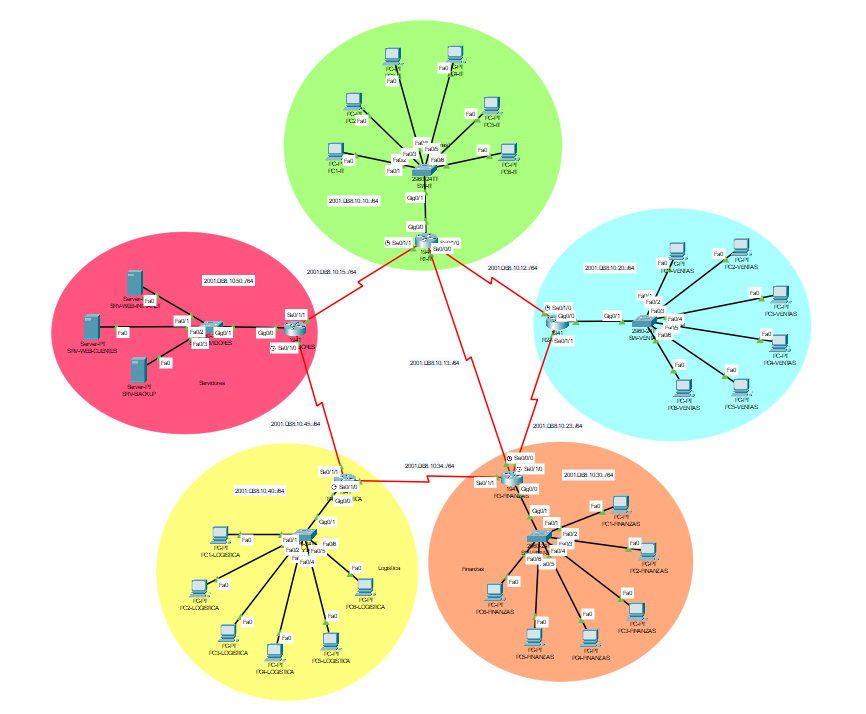

---

## 3. Direccionamiento

### LAN por departamento

| Router | Departamento | Prefijo LAN | Gateway (router) |
|---|---|---|---|
| R1 | IT | `2001:DB8:10:10::/64` | `2001:DB8:10:10::1` |
| R2 | Ventas | `2001:DB8:10:20::/64` | `2001:DB8:10:20::1` |
| R3 | Finanzas | `2001:DB8:10:30::/64` | `2001:DB8:10:30::1` |
| R4 | Logística | `2001:DB8:10:40::/64` | `2001:DB8:10:40::1` |
| R5 | Servidores | `2001:DB8:10:50::/64` | `2001:DB8:10:50::1` |

### Hosts

| LAN | Equipos | Direcciones |
|---|---|---|
| IT | IT-PC1 … IT-PC6 | `::10` a `::15` |
| Ventas | Ventas-PC1 … PC6 | `::10` a `::15` |
| Finanzas | Fin-PC1 … PC6 | `::10` a `::15` |
| Logística | Log-PC1 … PC6 | `::10` a `::15` |
| Servidores | SRV-WEB-INTRANET | `2001:DB8:10:50::10` |
| Servidores | SRV-WEB-CLIENTES | `2001:DB8:10:50::11` |
| Servidores | SRV-BACKUP | `2001:DB8:10:50::12` |

Los equipos administrativos de IT son **IT-PC1 (`2001:DB8:10:10::10`)** e **IT-PC2 (`2001:DB8:10:10::11`)**.

### Enlaces entre routers

| Enlace | Prefijo | Lado A | Lado B |
|---|---|---|---|
| R1 ↔ R2 | `2001:DB8:10:12::/64` | R1 `::1` | R2 `::2` |
| R2 ↔ R3 | `2001:DB8:10:23::/64` | R2 `::1` | R3 `::2` |
| R3 ↔ R4 | `2001:DB8:10:34::/64` | R3 `::1` | R4 `::2` |
| R4 ↔ R5 | `2001:DB8:10:45::/64` | R4 `::1` | R5 `::2` |
| R5 ↔ R1 | `2001:DB8:10:15::/64` | R1 `::1` | R5 `::2` |
| R1 ↔ R3 (diagonal) | `2001:DB8:10:13::/64` | R1 `::1` | R3 `::2` |

---

## 4. Enrutamiento con RIPng

RIPng es el equivalente de RIPv2 para IPv6 (UDP 521, multicast `FF02::9`). No existe el comando `network`: el protocolo se activa **por interfaz**, y eso incluye las interfaces LAN, que es lo que hace que cada router anuncie el prefijo de su departamento.

El nombre del proceso es una etiqueta local de cada router (no tiene que coincidir con la de sus vecinos), pero debe ser idéntico en `ipv6 router rip` y en cada `ipv6 rip ... enable` del mismo router. Aquí cada router usa el nombre de su departamento:

| Router | Nombre del proceso |
|---|---|
| R1 | `IT` |
| R2 | `VENTAS` |
| R3 | `FINANZAS` |
| R4 | `LOGISTICA` |
| R5 | `SERVIDORES` |

Configuración tipo, con R1 como ejemplo:

```
ipv6 unicast-routing
!
ipv6 router rip IT
!
interface <cada interfaz: enlaces y LAN>
 ipv6 address <dirección>/64
 ipv6 rip IT enable
 no shutdown
```

**Captura 2 — Tabla de rutas de R1.** `show ipv6 route` en R1: las LAN y los enlaces de los demás routers aparecen aprendidos por RIPng (marcados con `R`), con next hop en dirección link-local (`FE80::...`).

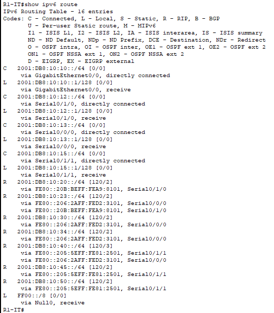

> Las ACL de este laboratorio se aplican **solo en las interfaces LAN**, nunca en los enlaces entre routers. Así no se interfiere con las actualizaciones de RIPng.

---

## 5. Qué cambia en las ACL con IPv6

| Concepto | IPv4 | IPv6 |
|---|---|---|
| Tipos de ACL | Estándar y extendida | Un solo tipo, con capacidades de extendida |
| ACL numeradas | Sí | No, solo nombradas |
| Coincidencia de red | Wildcard | Longitud de prefijo (`/64`) y `host` |
| Aplicar en interfaz | `ip access-group` | `ipv6 traffic-filter` |
| Aplicar en vty | `access-class` | `ipv6 access-class` |
| Resolución de MAC | ARP (capa 2, la ACL no lo ve) | Neighbor Discovery (ICMPv6, la ACL **sí** lo ve) |
| Reglas implícitas al final | `deny any` | Dos permits de ND y un `deny ipv6 any any` |
| Enrutamiento dinámico | RIPv2 | RIPng |

### Las reglas implícitas y por qué importan

Al final de toda ACL IPv6 existen estas tres reglas invisibles:

```
permit icmp any any nd-na
permit icmp any any nd-ns
deny ipv6 any any
```

Los dos primeros permits existen porque Neighbor Discovery reemplaza a ARP y viaja sobre ICMPv6, así que una ACL puede bloquearlo. Si se escribe un `deny ipv6 any any` **explícito** (para ver contadores, por ejemplo), este se evalúa antes que los permits implícitos y los anula: los equipos dejarían de resolver la MAC de su propio gateway. Por eso, en este laboratorio **cada ACL escribe a mano** `nd-na` y `nd-ns` antes de su `deny` final.

### ICMPv6 no se bloquea completo

ICMPv6 es parte del funcionamiento de la red, por lo que se filtra **por tipo**:

| Mensaje | Tipo | Tratamiento en este laboratorio |
|---|---|---|
| Neighbor Solicitation / Advertisement | 135 / 136 | Siempre permitidos |
| Packet Too Big | 2 | Siempre permitido (los routers IPv6 no fragmentan) |
| Echo request / reply (ping) | 128 / 129 | Se permite o se bloquea según la política |
| Router Solicitation / Advertisement | 133 / 134 | No se usan (direccionamiento estático) |

---

## 6. Políticas de seguridad y ACL

### Política 1 — Base obligatoria (todas las ACL)

Ninguna ACL puede tumbar el funcionamiento básico de IPv6. Todas permiten de forma explícita NS, NA y Packet Too Big, y todas terminan con un `deny ipv6 any any` escrito a mano para poder ver los contadores. En Packet Tracer, Packet Too Big se escribe con su número de tipo (`2`), como se explica en las [notas](#8-notas-sobre-packet-tracer).

---

### Política 2 — IT (R1)

IT son los administradores: acceden por HTTP y HTTPS a los dos servidores web, pueden hacer ping a cualquier equipo de la empresa (de ida y vuelta) y son los únicos que llegan al servidor de respaldo, con cualquier tipo de tráfico. Los dos hosts administrativos pueden además salir por SSH.

```
ipv6 access-list SALIDA_IT
 remark permitir salida de dos hosts para acceso remoto a los routers
 permit tcp host 2001:db8:10:10::10 any eq 22
 permit tcp host 2001:db8:10:10::11 any eq 22
 remark permitir salida de IT a los dos servidores web
 permit tcp 2001:db8:10:10::/64 host 2001:db8:10:50::10 eq 80
 permit tcp 2001:db8:10:10::/64 host 2001:db8:10:50::10 eq 443
 permit tcp 2001:db8:10:10::/64 host 2001:db8:10:50::11 eq 80
 permit tcp 2001:db8:10:10::/64 host 2001:db8:10:50::11 eq 443
 remark permitir todo tipo de trafico de IT al servidor de respaldo
 permit ipv6 2001:db8:10:10::/64 host 2001:db8:10:50::12
 remark permitir ping de IT hacia cualquier equipo de la empresa
 permit icmp 2001:db8:10:10::/64 any echo-request
 remark trafico obligatorio de IPV6 (NS, NA y Packet Too Big = ICMPv6 tipo 2)
 permit icmp any any nd-na
 permit icmp any any nd-ns
 permit icmp any any 2
 remark bloquear el resto del trafico de IT
 deny ipv6 any any
```

Aplicada en la interfaz de R1 que da hacia la LAN de IT, en sentido entrante:

```
ipv6 traffic-filter SALIDA_IT in
```

**Captura 7 — Contadores de la ACL en R1.** `show ipv6 access-list` en R1 después de las pruebas: las reglas de web, SSH, ping y respaldo acumulan matches, junto con los permits de ND.

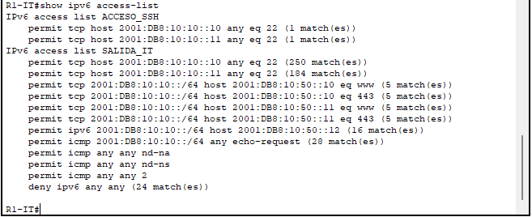

---

### Política 3 — Ventas (R2)

Ventas solo trabaja con el portal de clientes (`SRV-WEB-CLIENTES`) por HTTP y HTTPS. No tiene acceso a la intranet ni al respaldo, y **el ping que ellos inician está bloqueado** hacia cualquier destino. Sí deben poder responder los pings que hace IT.

```
ipv6 access-list SALIDA_VENTAS
 remark permitir trafico de VENTAS hacia el servidor web de clientes
 permit tcp 2001:db8:10:20::/64 host 2001:db8:10:50::11 eq 80
 permit tcp 2001:db8:10:20::/64 host 2001:db8:10:50::11 eq 443
 remark permitir respuesta a los pings de IT
 permit icmp 2001:db8:10:20::/64 2001:db8:10:10::/64 echo-reply
 remark trafico obligatorio de IPV6 (NS, NA y Packet Too Big = ICMPv6 tipo 2)
 permit icmp any any nd-na
 permit icmp any any nd-ns
 permit icmp any any 2
 remark bloquear el resto del trafico de VENTAS
 deny ipv6 any any
```

```
ipv6 traffic-filter SALIDA_VENTAS in
```

**Captura 5 — Ping bloqueado desde Ventas.** Un PC de Ventas intenta hacer ping y no recibe respuesta: el `echo-request` cae en el `deny ipv6 any any`.

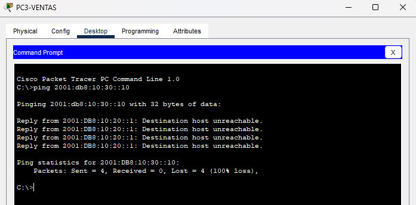

**Captura 8 — Contadores de la ACL en R2.** Se ven los matches del portal de clientes, del `echo-reply` hacia IT y del `deny` final por el ping bloqueado.

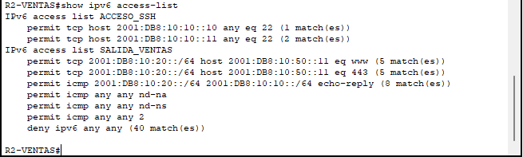

---

### Política 4 — Finanzas (R3)

Finanzas accede solo a la intranet (`SRV-WEB-INTRANET`) y **únicamente por HTTPS**. Puede hacer ping solo a ese servidor y no tiene acceso al portal de clientes. Responde los pings de IT.

```
ipv6 access-list SALIDA_FINANZAS
 remark permitir trafico HTTPS y ping hacia el servidor Intranet
 permit tcp 2001:db8:10:30::/64 host 2001:db8:10:50::10 eq 443
 permit icmp 2001:db8:10:30::/64 host 2001:db8:10:50::10 echo-request
 remark permitir respuesta a los pings de IT
 permit icmp 2001:db8:10:30::/64 2001:db8:10:10::/64 echo-reply
 remark trafico obligatorio de IPV6 (NS, NA y Packet Too Big = ICMPv6 tipo 2)
 permit icmp any any nd-na
 permit icmp any any nd-ns
 permit icmp any any 2
 remark bloquear el resto del trafico de FINANZAS
 deny ipv6 any any
```

```
ipv6 traffic-filter SALIDA_FINANZAS in
```

**Captura 4 — Finanzas accede a la intranet por HTTPS.** Un PC de Finanzas abre la intranet por HTTPS: la regla `eq 443` lo permite.

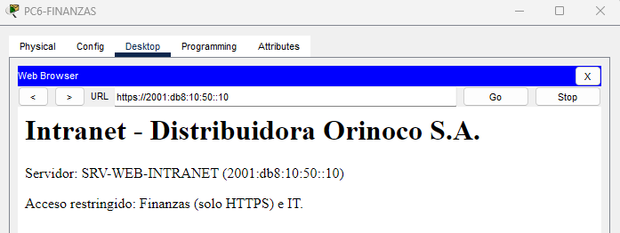

**Captura 9 — Contadores de la ACL en R3.** Matches en HTTPS, en el ping a la intranet y en el `deny` final por el tráfico no autorizado.

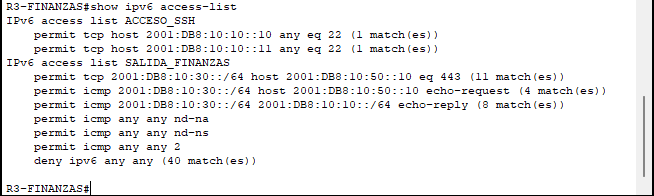

---

### Política 5 — Logística (R4)

Logística consulta el portal de clientes por HTTP y HTTPS y puede hacer ping solo a ese servidor. Responde los pings de IT.

```
ipv6 access-list SALIDA_LOGISTICA
 remark permitir trafico web y ping de logistica hacia el servidor de clientes
 permit tcp 2001:db8:10:40::/64 host 2001:db8:10:50::11 eq 80
 permit tcp 2001:db8:10:40::/64 host 2001:db8:10:50::11 eq 443
 permit icmp 2001:db8:10:40::/64 host 2001:db8:10:50::11 echo-request
 remark permitir respuesta a los pings de IT
 permit icmp 2001:db8:10:40::/64 2001:db8:10:10::/64 echo-reply
 remark trafico obligatorio de IPV6 (NS, NA y Packet Too Big = ICMPv6 tipo 2)
 permit icmp any any nd-na
 permit icmp any any nd-ns
 permit icmp any any 2
 remark bloquear el resto del trafico de LOGISTICA
 deny ipv6 any any
```

```
ipv6 traffic-filter SALIDA_LOGISTICA in
```

**Captura 3 — Logística accede al portal de clientes.** Un PC de Logística abre la página del portal de clientes.

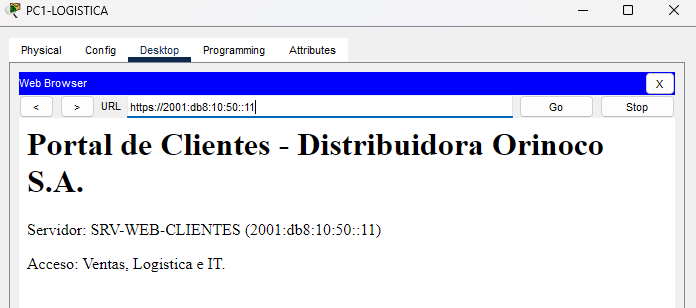

**Captura 10 — Contadores de la ACL en R4.** Matches en la web y el ping permitidos hacia `SRV-WEB-CLIENTES`, y en el `deny` final.

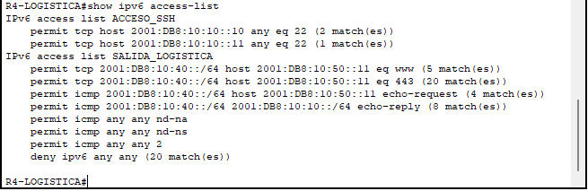

---

### Política 6 — Servidores (R5)

Los servidores **nunca inician nada: solo responden**, y únicamente a quien tiene derecho a consultarlos. En el sentido de las respuestas, el puerto web va en el **origen** de la regla (`eq 80`, `eq 443`).

| Servidor | Responde a | Qué responde |
|---|---|---|
| SRV-WEB-INTRANET (`::10`) | IT | HTTP, HTTPS, ping |
| SRV-WEB-INTRANET (`::10`) | Finanzas | Solo HTTPS y ping |
| SRV-WEB-CLIENTES (`::11`) | IT, Ventas, Logística | HTTP y HTTPS |
| SRV-WEB-CLIENTES (`::11`) | IT, Logística | Ping |
| SRV-BACKUP (`::12`) | IT | Cualquier tráfico |

```
ipv6 access-list RESPUESTAS_SERVIDORES
 remark permitir respuestas de los servidores a las consultas de IT
 permit tcp host 2001:db8:10:50::10 eq 80 2001:db8:10:10::/64 established
 permit tcp host 2001:db8:10:50::10 eq 443 2001:db8:10:10::/64 established
 permit tcp host 2001:db8:10:50::11 eq 80 2001:db8:10:10::/64 established
 permit tcp host 2001:db8:10:50::11 eq 443 2001:db8:10:10::/64 established
 remark permitir respuestas del servidor de respaldo a las consultas de IT
 permit ipv6 host 2001:db8:10:50::12 2001:db8:10:10::/64
 remark permitir respuestas de ping a las consultas de IT
 permit icmp 2001:db8:10:50::/64 2001:db8:10:10::/64 echo-reply
 remark permitir respuestas del servidor de Clientes hacia VENTAS
 permit tcp host 2001:db8:10:50::11 eq 80 2001:db8:10:20::/64 established
 permit tcp host 2001:db8:10:50::11 eq 443 2001:db8:10:20::/64 established
 remark permitir respuestas del servidor de Intranet hacia FINANZAS
 permit tcp host 2001:db8:10:50::10 eq 443 2001:db8:10:30::/64 established
 permit icmp host 2001:db8:10:50::10 2001:db8:10:30::/64 echo-reply
 remark permitir respuestas del servidor de Clientes hacia LOGISTICA
 permit tcp host 2001:db8:10:50::11 eq 80 2001:db8:10:40::/64 established
 permit tcp host 2001:db8:10:50::11 eq 443 2001:db8:10:40::/64 established
 permit icmp host 2001:db8:10:50::11 2001:db8:10:40::/64 echo-reply
 remark trafico obligatorio de IPV6 (NS, NA y Packet Too Big = ICMPv6 tipo 2)
 permit icmp any any nd-na
 permit icmp any any nd-ns
 permit icmp any any 2
 remark bloquear el resto del trafico de SERVIDORES
 deny ipv6 any any
```

```
ipv6 traffic-filter RESPUESTAS_SERVIDORES in
```

> **Limitación de las ACL sin estado.** La regla `permit ipv6 host ...::12 ...` deja pasar cualquier tráfico del respaldo hacia IT, incluido el que el propio respaldo inicie, porque la política 2 permite *cualquier* tipo de tráfico de IT hacia ese servidor y no hay un puerto concreto que acotar. Es una decisión consciente y queda documentada.

**Captura 11 — Contadores de la ACL en R5.** Cada respuesta de los servidores (web y ping) pasa por esta ACL, por lo que los matches se reparten entre las reglas de IT, Ventas, Finanzas y Logística.

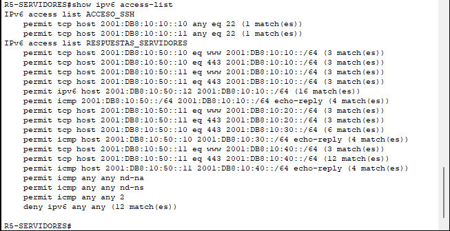

---

### Política 7 — Acceso remoto a los routers

Solo **IT-PC1 e IT-PC2** pueden entrar por SSH a los cinco routers. Nadie más, ni siquiera el resto de IT. SSH versión 2 y sin Telnet.

Esta política se resuelve en **dos capas**:

1. **En el origen:** `SALIDA_IT` (R1) solo deja salir el tráfico SSH de esos dos hosts.
2. **En el destino:** una ACL en las líneas vty de **los 5 routers**.

```
ipv6 access-list ACCESO_SSH
 remark permitir acceso remoto solo a dos hosts de IT
 permit tcp host 2001:db8:10:10::10 any eq 22
 permit tcp host 2001:db8:10:10::11 any eq 22
!
ip domain-name orinoco.local
crypto key generate rsa modulus 2048
username anderson secret anderson
ip ssh version 2
!
line vty 0 4
 ipv6 access-class ACCESO_SSH in
 transport input ssh
 login local
```

**Credenciales del laboratorio:** en los 5 routers el usuario es `anderson` y la contraseña es `anderson`. Son credenciales de práctica en un entorno simulado; en una red real se usarían contraseñas robustas.

> La ACL de vty no necesita los permits de ND ni un deny explícito: recibe conexiones TCP, no tráfico de Neighbor Discovery, y el deny implícito basta.

**Captura 6 — Acceso SSH de un administrador.** Un equipo administrativo de IT entra por SSH a un router.

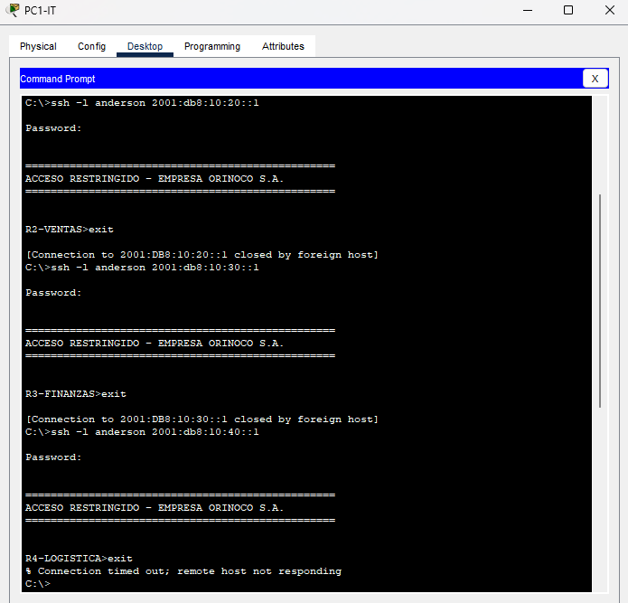

---

## 7. Resumen de resultados

| Política | Prueba | Resultado | Evidencia |
|---|---|---|---|
| RIPng | Los routers aprenden las redes de los demás | Funciona | [Captura 2](#4-enrutamiento-con-ripng) |
| 2 — IT | Web, SSH, ping y respaldo | Permitido, con matches | [Captura 7](#política-2--it-r1) |
| 3 — Ventas | Ping iniciado por Ventas | Bloqueado | [Captura 5](#política-3--ventas-r2) |
| 3 — Ventas | Portal de clientes y respuesta a IT | Permitido, con matches | [Captura 8](#política-3--ventas-r2) |
| 4 — Finanzas | Intranet por HTTPS | Permitido | [Captura 4](#política-4--finanzas-r3) |
| 4 — Finanzas | Contadores de la ACL | Matches en permits y `deny` | [Captura 9](#política-4--finanzas-r3) |
| 5 — Logística | Portal de clientes | Permitido | [Captura 3](#política-5--logística-r4) |
| 5 — Logística | Contadores de la ACL | Matches en permits y `deny` | [Captura 10](#política-5--logística-r4) |
| 6 — Servidores | Respuestas a cada LAN autorizada | Permitido, con matches | [Captura 11](#política-6--servidores-r5) |
| 7 — Acceso remoto | SSH desde un administrador | Permitido | [Captura 6](#política-7--acceso-remoto-a-los-routers) |

---

## 8. Notas sobre Packet Tracer

- **Packet Too Big:** esta versión de Packet Tracer no ofrece el nombre simbólico `packet-too-big` en `permit icmp any any ?`, pero sí acepta el número del tipo ICMPv6, por eso se usa `permit icmp any any 2`. En un IOS real el nombre sí existe. Al ser una regla preventiva, su contador normalmente queda en cero en una simulación de este tamaño.
- **Puerto de origen en las respuestas:** cuando una regla lleva puerto de origen (`eq 80`), el parser exige que el destino cierre con un operador de puerto o con `established`. En `RESPUESTAS_SERVIDORES` se usó `established`, que además solo deja pasar segmentos TCP de una conexión ya iniciada (con ACK o RST), es decir, respuestas y no conexiones nuevas del servidor. Si `established` no coincide en alguna versión del simulador, `gt 0` en el destino es la alternativa.
- **Destinos individuales:** una dirección suelta sin prefijo no es válida en una ACL IPv6; se usa `host` o `/128`.
- **Nombres de tipos ICMPv6:** varían entre versiones; `permit icmp any any ?` lista los que acepta cada equipo.

---

## 9. Comandos de verificación

```
show ipv6 route                 ! rutas aprendidas por RIPng (R)
show ipv6 protocols             ! interfaces que participan en RIPng
show ipv6 interface <interfaz>  ! ACL aplicada y sentido
show ipv6 access-list           ! reglas con contadores de matches
clear ipv6 access-list          ! reinicia los contadores antes de probar
```

---

## 10. Estructura de la carpeta

```
acl-ipv6/
├── README.md
├── ACL-ipv6.pkt
└── capturas/
    ├── 01-topologia-completa.png
    ├── 02-ripng-tabla-rutas-r1.png
    ├── 03-logistica-web-ok.png
    ├── 04-finanzas-https-ok.png
    ├── 05-ventas-ping-bloqueado.png
    ├── 06-ssh-admin-ok.png
    ├── 07-acl-r1.png
    ├── 08-acl-r2.png
    ├── 09-acl-r3.png
    ├── 10-acl-r4.png
    └── 11-acl-r5.png
```
